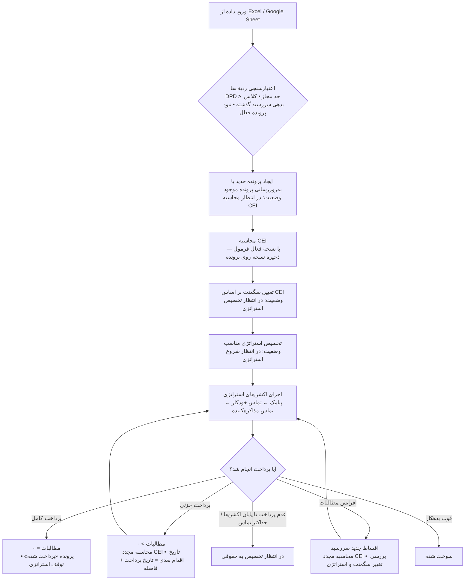

# سند نیازمندی‌های محصول (PRD)
## سیستم وصول مطالبات دیجی‌پی

> نسخه اول — Product Requirements Document  
> **به‌روزرسانی:** auth JWT/RBAC · گزارشات · audit معماری · پلن تست/refactor (بخش ۱۰.۹)
> سند مرجع مشترک تیم‌های محصول، طراحی و توسعه

---

## فهرست مطالب

1. [مقدمه و زمینه](#۱-مقدمه-و-زمینه)
2. [محدوده محصول](#۲-محدوده-محصول)
3. [کاربران، نقش‌ها و دسترسی‌ها](#۳-کاربران-نقشها-و-دسترسیها)
4. [معماری کلی محصول](#۴-معماری-کلی-محصول)
5. [منطق‌های اصلی محصول](#۵-منطقهای-اصلی-محصول)
6. [وضعیت‌های پرونده و وضعیت اقدام](#۶-وضعیتهای-پرونده-و-وضعیت-اقدام)
7. [User Stories](#۷-user-stories)
8. [موارد باز و تصمیمات آینده](#۸-موارد-باز-و-تصمیمات-آینده)
9. [مرجع سریع](#۹-مرجع-سریع)
10. [پیاده‌سازی نسخه دمو — تکمیل‌ها و انحراف‌ها](#۱۰-پیاده‌سازی-نسخه-دمو--تکمیلها-و-انحرافها)

---

# ۱. مقدمه و زمینه

## ۱.۱ هدف سند

این سند نیازمندی‌های محصول سیستم وصول مطالبات دیجی‌پی را برای نسخه اول توصیف می‌کند. هدف از تدوین این سند، ایجاد یک مرجع مشترک میان تیم‌های محصول، طراحی و توسعه جهت پیاده‌سازی محصول است.

این سند شامل اهداف محصول، محدوده، نقش‌ها، منطق‌های اصلی، وضعیت‌های پرونده، صفحات، عملیات‌ها، ادمین پنل، گزارشات، وابستگی‌ها، اینتگریشن‌ها و موارد باز است.

## ۱.۲ پیش‌زمینه و مشکل فعلی

در حال حاضر فرآیند وصول مطالبات برای مشتریانی که بدهی سررسید گذشته دارند، به صورت دستی یا نیمه‌دستی انجام می‌شود. اطلاعات بدهکاران، پرونده‌ها، وضعیت تماس‌ها، تعهدات پرداخت، پرداخت‌های جزئی و کامل و سوابق پیگیری‌ها در ابزارهای پراکنده نگهداری می‌شوند.

این پراکندگی باعث می‌شود تیم وصول مطالبات تصویر یکپارچه‌ای از وضعیت هر بدهکار و هر پرونده نداشته باشد. همچنین فرآیند تخصیص پرونده به مذاکره‌کنندگان دستی و زمان‌بر است و سابقه تماس‌ها، مذاکره‌ها، نتایج تماس و Promise to Pay به شکل منسجم ثبت نمی‌شود.

از سوی دیگر، اولویت‌بندی پرونده‌ها بر اساس شاخص مشخصی انجام نمی‌شود و تصمیم‌گیری درباره شدت پیگیری، زمان تماس، ارجاع به مذاکره‌کننده یا ارجاع به حقوقی تا حد زیادی وابسته به تشخیص دستی است.

همچنین امکان سنجش دقیق اثربخشی اقدامات مختلف مانند پیامک، تماس خودکار و تماس مذاکره‌کننده وجود ندارد و تیم وصول مطالبات نمی‌تواند به شکل دقیق بررسی کند که کدام استراتژی یا کدام اکشن بیشترین اثر را در وصول مطالبات داشته است.

## ۱.۳ چرا این مشکل مهم است؟

این مشکل از چند جهت برای دیجی‌پی اهمیت دارد.

اول، مطالبات سررسید گذشته مستقیماً روی جریان نقدی و سلامت مالی کسب‌وکار اثر می‌گذارد. هرچه فرآیند وصول دیرتر، نامنظم‌تر یا بدون اولویت‌بندی انجام شود، احتمال وصول موفق کاهش پیدا می‌کند.

دوم، تجربه مشتری نیز تحت تأثیر قرار می‌گیرد. اگر مشتری قبلاً پرداخت جزئی انجام داده یا تعهد پرداخت داده باشد، سیستم باید این رفتار را تشخیص دهد و با رویکرد مناسب‌تری ادامه دهد. در نبود سیستم منسجم، ممکن است مشتری‌ای که در حال همکاری است همچنان با اکشن‌های سنگین مواجه شود.

سوم، نبود تاریخچه کامل باعث می‌شود مذاکره‌کننده در هر تماس تصویر دقیقی از سابقه مشتری نداشته باشد. این موضوع کیفیت مذاکره، احتمال وصول و تصمیم‌گیری درباره ارجاع به حقوقی را تحت تأثیر قرار می‌دهد.

چهارم، تیم وصول مطالبات برای بهبود فرآیندها نیاز به گزارش و تحلیل دارد. بدون داده ساختاریافته، امکان مقایسه استراتژی‌ها، تحلیل نرخ تبدیل اکشن‌ها، بررسی عملکرد مذاکره‌کنندگان و بهینه‌سازی هزینه وصول وجود ندارد.

## ۱.۴ چرا به این محصول نیاز داریم؟

این محصول برای ایجاد یک سیستم متمرکز، قابل ردیابی و قابل تحلیل در فرآیند وصول مطالبات طراحی می‌شود. سیستم باید بتواند پرونده‌های بدهی را از لحظه ایجاد تا پرداخت، پرداخت جزئی، سوخت شدن یا ارجاع به حقوقی مدیریت کند.

این محصول با محاسبه شاخص سختی وصول یا CEI، تعریف سگمنت‌ها و تخصیص استراتژی‌های متناسب، کمک می‌کند هر پرونده متناسب با سطح سختی وصول خود پیگیری شود.

همچنین با ثبت تاریخچه کامل اقدامات، تعهدات پرداخت، تماس‌ها، پرداخت‌ها و تغییرات پرونده، تصمیم‌گیری مذاکره‌کننده و ادمین دقیق‌تر می‌شود.

## ۱.۵ اهداف محصول

- ایجاد سیستم متمرکز برای مدیریت پرونده‌های بدهی از لحظه ایجاد تا تعیین تکلیف نهایی
- ورود و به‌روزرسانی اطلاعات پرونده‌ها از طریق Excel
- ورود و به‌روزرسانی اطلاعات پرونده‌ها از طریق سینک دستی با Google Sheet
- ورود و به‌روزرسانی اطلاعات پرداخت‌ها از طریق Excel
- ورود و به‌روزرسانی اطلاعات پرداخت‌ها از طریق سینک دستی با Google Sheet
- محاسبه شاخص سختی وصول یا CEI برای هر پرونده
- تخصیص سگمنت و استراتژی مناسب بر اساس CEI
- مدیریت فرآیند پیامک، تماس خودکار و تماس مذاکره‌کننده
- مدیریت تخصیص و تخصیص مجدد پرونده به مذاکره‌کننده
- ثبت خروجی تماس و تعهد پرداخت
- کنترل مهلت مجاز تعهد پرداخت بر اساس تنظیمات ادمین پنل
- ثبت تاریخچه کامل تمامی اقدامات
- فراهم‌سازی گزارشات عملکردی
- فراهم‌سازی امکان مقایسه استراتژی‌ها از طریق A/B Test

## ۱.۶ معیارهای موفقیت

- کاهش زمان صرف‌شده توسط ادمین جهت مدیریت پرونده‌ها
- افزایش نرخ وصول مطالبات از طریق پیگیری منظم‌تر
- کاهش پرونده‌هایی که بدون پیگیری منظم به مرحله حقوقی می‌رسند
- افزایش شفافیت در تاریخچه اقدامات انجام‌شده روی هر پرونده
- امکان مقایسه اثربخشی استراتژی‌های مختلف
- امکان محاسبه هزینه عملیاتی وصول و نسبت آن به مبلغ وصول‌شده
- بهبود کیفیت مذاکره از طریق نمایش اطلاعات کامل بدهکار و پرونده

---

# ۲. محدوده محصول

## ۲.۱ آنچه داخل Scope است

- مدیریت بدهکاران و اطلاعات تماس آن‌ها
- مدیریت آدرس‌ها و منابع اطلاعات تماس و آدرس
- مدیریت پرونده‌های بدهی
- ورود و به‌روزرسانی اطلاعات پرونده‌ها از طریق Excel
- سینک دستی اطلاعات پرونده‌ها از طریق Google Sheet
- ورود و به‌روزرسانی اطلاعات پرداخت‌ها از طریق Excel
- سینک دستی اطلاعات پرداخت‌ها از طریق Google Sheet
- محاسبه شاخص سختی وصول یا CEI
- تعریف و نسخه‌بندی فرمول CEI
- تعریف سگمنت‌ها بر اساس CEI
- تعریف استراتژی‌های وصول شامل اکشن‌هایی مانند پیامک، تماس خودکار و تماس مذاکره‌کننده
- اجرای خودکار اکشن‌های تعریف‌شده در استراتژی
- تخصیص پرونده به مذاکره‌کننده
- تخصیص مجدد پرونده
- مدیریت فرآیند مذاکره و ثبت خروجی تماس
- ثبت Promise to Pay و کنترل سقف مهلت پرداخت
- ثبت پرداخت کامل و پرداخت جزئی
- ارجاع پرونده‌های ناموفق به حقوقی
- گزارشات عملکردی
- A/B Test برای مقایسه استراتژی‌ها
- ادمین پنل برای تنظیم قوانین، فرمول CEI، سگمنت‌ها، تنظیمات عمومی و تنظیمات اتصال به Google Sheet

## ۲.۲ آنچه خارج از Scope است

- دریافت خودکار اطلاعات از سرویس Installment از طریق API
- فرآیند داخلی تیم حقوقی پس از ارجاع پرونده
- مدیریت پرونده‌های دارای Underwriter
- استعلام دارایی‌های بدهکار
- برقراری تماس مستقیم از داخل محصول
- اتصال مستقیم به سرویس پرداخت برای تشخیص Real-time پرداخت‌ها
- زمان‌بندی خودکار سینک با Google Sheet بدون دخالت ادمین

## ۲.۳ نسخه‌های آینده

- اتصال API به سرویس Installment جهت دریافت خودکار اطلاعات پرونده‌ها، اقساط و پرداخت‌ها
- فرآیند کامل تیم حقوقی داخل محصول
- تخصیص خودکار Agent
- مدل پیش‌بینی رفتار پرداخت
- دریافت Real-time پرداخت‌ها از سرویس پرداخت
- سینک زمان‌بندی‌شده با منابع داده
- اتصال مستقیم به سیستم تماس

---

# ۳. کاربران، نقش‌ها و دسترسی‌ها

## ۳.۱ ادمین وصول مطالبات

ادمین وصول مطالبات مسئول مدیریت کلی فرآیند وصول مطالبات است. وظایف اصلی ادمین شامل موارد زیر است:

- تنظیم قوانین و پارامترهای سیستم
- مدیریت مذاکره‌کنندگان
- تخصیص پرونده‌ها به مذاکره‌کنندگان
- تخصیص مجدد پرونده‌ها
- بارگذاری اطلاعات پرونده‌ها و پرداخت‌ها از Excel
- اجرای سینک دستی با Google Sheet
- مشاهده تاریخچه عملیات گروهی
- تعریف فرمول CEI
- تعریف سگمنت‌ها
- تعریف استراتژی‌ها
- ایجاد سناریو A/B Test
- مشاهده گزارشات
- نظارت بر عملکرد کل سیستم

## ۳.۲ مذاکره‌کننده

مذاکره‌کننده مسئول پیگیری مستقیم پرونده‌های تخصیص‌یافته به خود است. وظایف اصلی مذاکره‌کننده شامل تماس با بدهکاران، ثبت نتایج مذاکره، ثبت تعهدات پرداخت و درخواست ارجاع به حقوقی است.

هر مذاکره‌کننده دارای مشخصات زیر است:

- نام مذاکره‌کننده
- وضعیت: فعال / غیرفعال
- نوع همکاری: داخلی / برون‌سپاری
- ظرفیت کاری
- حقوق ساعتی
- تعداد پرونده‌های فعال
- تعداد تماس‌های امروز
- تعداد اقدامات معوق
- نرخ موفقیت

حقوق ساعتی مذاکره‌کننده برای محاسبه هزینه تماس‌های مذاکره‌کننده استفاده می‌شود.

> **فرمول هزینه تماس مذاکره‌کننده (ثبت واقعی):**
> هزینه هر تماس = `حقوق ساعتی × مدت تماس واقعی (دقیقه) ÷ ۶۰`
> مدت تماس از فیلد «مدت تماس به دقیقه» در مدال ثبت خروجی خوانده می‌شود. اگر وضعیت تماس **پاسخگو نبود** باشد، مدت = ۰ و هزینه = ۰.
> فیلد `avg_call_duration` در استراتژی فقط برای برنامه‌ریزی/تخمین است، نه محاسبه هزینه ثبت‌شده.

## ۳.۳ جدول دسترسی‌ها

| بخش / عملیات | ادمین | مذاکره‌کننده |
|---|---|---|
| صفحه بدهکاران | دسترسی کامل | دسترسی کامل |
| صفحه پرونده‌ها | تمامی پرونده‌ها | تمامی پرونده‌ها |
| صفحه اقساط | دارد | دارد |
| تاریخچه تغییرات | دارد | دارد |
| ثبت خروجی تماس | دارد | فقط برای پرونده‌های خودش |
| اضافه کردن شماره تماس | دارد | دارد |
| صفحه استراتژی‌ها | فقط ادمین | — |
| صفحه مذاکره‌کنندگان | فقط ادمین | — |
| عملیات گروهی | فقط ادمین | — |
| ادمین پنل | فقط ادمین | — |
| صفحه گزارشات | فقط ادمین | — |

## ۳.۴ پیاده‌سازی دسترسی در نسخه دمو

> مرجع فنی: [TECHNICAL.md §۱۰](./TECHNICAL.md#۱۰-احراز-هویت-و-دسترسی)

| موضوع | وضعیت دمو |
|--------|-----------|
| Login / Register / Forgot password | **پیاده شده** — JWT 8h |
| جدول `users` / `roles` / `permissions` | **پیاده شده** |
| Backend middleware | `authenticate` + `requireAdmin` |
| RBAC granular | **seed شده، enforce ناقص** |
| Frontend | `ProtectedRoute` + صفحات auth |
| Audit | `user_name` از `req.user` (سرور) |

**کاربر seed:** `zahra.hamdi` / `Admin@1234` — admin + سوپر ادمین

**تفکیک negotiator vs user:** `negotiators.user_id` → `users`

**ثبت‌نام:** بدون نقش → `/waiting`

## ۳.۵ وابستگی‌ها

این محصول برای عملکرد صحیح به چند منبع داده و سرویس وابسته است.

### ۳.۵.۱ منبع اطلاعات پرونده‌ها
در نسخه اول، اطلاعات پرونده‌ها از طریق فایل Excel یا Google Sheet دریافت می‌شود. این اطلاعات شامل مشخصات بدهکار، شناسه اعتبار، نوع اعتبار، مطالبات غیرجاری، جریمه، DPD، کلاس بدهی و اطلاعات اقساط است.

### ۳.۵.۲ منبع اطلاعات پرداخت‌ها
اطلاعات پرداخت‌ها در نسخه اول از طریق Excel یا Google Sheet دریافت می‌شود. سیستم در نسخه اول API مستقیم برای دریافت پرداخت‌ها ندارد و پرداخت کامل یا جزئی از طریق فایل یا شیت ثبت می‌شود.

### ۳.۵.۳ اطلاعات اقساط
در نسخه اول، اطلاعات اقساط از همان فایل Excel یا Google Sheet مربوط به پرونده‌ها دریافت می‌شود. در نسخه‌های آینده و پس از اتصال به سرویس Installment، امکان دریافت مستقیم اقساط از API بررسی خواهد شد.

### ۳.۵.۴ سرویس پیامک
برای ارسال پیامک‌های استراتژی، پیامک پس از تماس بی‌پاسخ و لینک پرداخت، محصول به سرویس پیامک وابسته است.

### ۳.۵.۵ سرویس تماس خودکار
برای اجرای اکشن‌های تماس خودکار، محصول به سرویس تماس خودکار وابسته است. جزئیات فنی این اتصال هنوز نهایی نشده است.

### ۳.۵.۶ لینک پرداخت
برای ارسال لینک پرداخت در پیامک یا توسط مذاکره‌کننده، سیستم به لینک پرداخت معتبر نیاز دارد. نحوه تولید یا دریافت این لینک باید با تیم مربوطه نهایی شود.

### ۳.۵.۷ اطلاعات رتبه مشتری
رتبه مشتری در ساید بار پرونده نمایش داده می‌شود، اما منبع دریافت آن هنوز نهایی نشده است.

### ۳.۵.۸ اطلاعات جریمه
مبلغ جریمه در پرونده نمایش داده می‌شود و در گزارشات نیز استفاده می‌شود، اما نحوه محاسبه و منبع دریافت آن باید با تیم Installment نهایی شود.

## ۳.۶ یکپارچگی‌ها

اینتگریشن‌های مورد نیاز محصول به شرح زیر است.

### ۳.۶.۱ Excel Upload
برای دو عملیات اصلی استفاده می‌شود:

- بارگذاری پرونده‌های جدید یا به‌روزرسانی پرونده‌های موجود
- بارگذاری دسته‌ای پرداخت‌های کاربران

در هر دو حالت، سیستم باید ردیف‌های سالم را پردازش کند و ردیف‌های دارای خطا را با دلیل خطا در گزارش خروجی نمایش دهد.

### ۳.۶.۲ Google Sheet Manual Sync
در نسخه اول، علاوه بر Excel، امکان سینک دستی با Google Sheet نیز وجود دارد. این سینک به صورت خودکار زمان‌بندی‌شده نیست و توسط ادمین از صفحه پرونده‌ها اجرا می‌شود.

تنظیمات مربوط به Google Sheet شامل آدرس شیت‌ها، نام شیت‌ها، نوع شیت و تنظیمات دسترسی در ادمین پنل مدیریت می‌شود.

دو عملیات سینک تعریف می‌شود:

- سینک با Google Sheet پرونده‌ها
- سینک با Google Sheet پرداخت‌ها

در هر دو عملیات، سیستم داده‌ها را از Google Sheet می‌خواند و منطق پردازش آن مشابه منطق Excel است. اگر ردیفی قابل پردازش نباشد، سیستم باید خطا را روی همان Google Sheet و در ستون مشخصی مانند «دلیل خطا» ثبت کند. همچنین وضعیت پردازش هر ردیف می‌تواند در ستون «وضعیت پردازش» ثبت شود.

### ۳.۶.۳ SMS Provider
برای ارسال پیامک‌های تعریف‌شده در استراتژی، ارسال پیامک پس از تماس بی‌پاسخ و ارسال لینک پرداخت استفاده می‌شود.

### ۳.۶.۴ Auto Call Provider
برای اجرای اکشن‌های تماس خودکار استفاده می‌شود. جزئیات فنی این اتصال هنوز باز است.

### ۳.۶.۵ Payment Link
برای ارسال لینک پرداخت به بدهکار استفاده می‌شود. لینک پرداخت می‌تواند در قالب Placeholder داخل پیامک یا از طریق دکمه ارسال لینک پرداخت در مدال تماس مذاکره‌کننده ارسال شود.

---

# ۴. معماری کلی محصول

## ۴.۱ ماژول‌های اصلی

1. **مدیریت بدهکاران:** نگهداری اطلاعات بدهکاران، شماره‌های تماس، آدرس‌ها، منابع اطلاعات تماس و آدرس، مجموع مطالبات و مجموع جریمه‌های هر بدهکار.
2. **مدیریت پرونده‌ها:** ایجاد، به‌روزرسانی، نمایش و پیگیری وضعیت پرونده‌های بدهی، وضعیت اقدام، مسئول پرونده، اطلاعات مالی، اطلاعات اقساط، CEI، سگمنت و استراتژی فعال پرونده.
3. **ورود و به‌روزرسانی داده‌ها:** دریافت اطلاعات پرونده‌ها و پرداخت‌ها از طریق Excel و Google Sheet، اعتبارسنجی داده‌ها، پردازش ردیف‌های سالم و ثبت خطاهای ردیف‌های نامعتبر.
4. **موتور محاسبه CEI و سگمنت‌بندی:** محاسبه شاخص سختی وصول، نگهداری نسخه فرمول CEI، تعیین سگمنت پرونده و به‌روزرسانی CEI در شرایط افزایش مطالبات یا پرداخت جزئی.
5. **مدیریت استراتژی‌ها و اکشن‌ها:** تعریف، ویرایش و مدیریت استراتژی‌های وصول، تعریف اکشن‌های پیامک، تماس خودکار و تماس مذاکره‌کننده، تعیین ترتیب اکشن‌ها، بازه زمانی اجرا، زمان انتظار، هزینه اکشن‌ها و سناریوهای A/B Test.
6. **موتور اجرای استراتژی:** اجرای خودکار اکشن‌های تعریف‌شده در استراتژی فعال پرونده، کنترل بازه زمانی اجرای اکشن‌ها، Respite Time، بررسی وضعیت پرداخت و انتقال پرونده به اکشن بعدی.
7. **تخصیص پرونده و مدیریت مذاکره‌کنندگان:** مدیریت مذاکره‌کنندگان، ظرفیت کاری، نوع همکاری، حقوق ساعتی، وضعیت فعال یا غیرفعال، تخصیص و تخصیص مجدد پرونده‌ها به مذاکره‌کنندگان.
8. **فرآیند مذاکره:** مدیریت تماس‌های مذاکره‌کننده، ثبت خروجی تماس، ثبت دلیل عدم پرداخت، Promise to Pay، زمان تماس بعدی، ارسال لینک پرداخت و ارجاع به حقوقی.
9. **مدیریت پرداخت‌ها:** ثبت و پردازش پرداخت‌های کامل و جزئی، به‌روزرسانی مطالبات، تغییر وضعیت پرونده در پرداخت کامل و اعمال منطق پرداخت جزئی.
10. **تاریخچه و Audit Trail:** ثبت و نمایش تمامی عملیات‌های سیستمی و کاربری روی پرونده، شامل ایجاد پرونده، محاسبه CEI، تغییر استراتژی، ارسال پیامک، تماس خودکار، ثبت پرداخت، تخصیص و ثبت خروجی تماس.
11. **عملیات گروهی:** مدیریت بارگذاری Excel، تخصیص گروهی، تخصیص مجدد گروهی، و نمایش تاریخچه عملیات گروهی.
12. **گزارشات:** نمایش گزارش‌های عملکردی، نرخ تبدیل اکشن‌ها، مبلغ وصول‌شده، هزینه عملیاتی، ROI، عملکرد مذاکره‌کنندگان و نتایج A/B Test.
13. **ادمین پنل:** تنظیمات قوانین ایجاد پرونده، فرمول CEI، سگمنت‌ها، تنظیمات عمومی، سقف Promise to Pay، فاصله پرداخت جزئی و تنظیمات اتصال به Google Sheet.

## ۴.۲ فلوی کلی محصول

1. اطلاعات پرونده‌ها از طریق Excel یا سینک دستی با Google Sheet وارد سیستم می‌شود.
2. سیستم هر ردیف را اعتبارسنجی می‌کند.
3. برای ردیف‌های سالم، پرونده جدید ایجاد می‌شود یا پرونده موجود به‌روزرسانی می‌شود.
4. برای پرونده‌های جدید، CEI محاسبه می‌شود.
5. بر اساس CEI، سگمنت پرونده تعیین می‌شود.
6. بر اساس سگمنت، استراتژی مناسب به پرونده تخصیص داده می‌شود.
7. اکشن‌های استراتژی در زمان‌بندی مشخص اجرا می‌شوند.
8. اگر پرونده به مرحله تماس مذاکره‌کننده برسد، به مذاکره‌کننده تخصیص داده می‌شود.
9. مذاکره‌کننده نتیجه تماس را ثبت می‌کند.
10. در صورت ثبت Promise to Pay، تاریخ اقدام بعدی برابر تاریخ تعهد پرداخت تعیین می‌شود.
11. اطلاعات پرداخت‌ها از طریق Excel یا سینک دستی با Google Sheet وارد سیستم می‌شود.
12. در صورت پرداخت کامل، پرونده پرداخت شده می‌شود.
13. در صورت پرداخت جزئی، مطالبات کاهش یافته، CEI مجدداً محاسبه شده و منطق پرداخت جزئی اعمال می‌شود.
14. اگر مطالبات به دلیل سررسید گذشتن اقساط جدید افزایش یابد، CEI مجدداً محاسبه شده و در صورت تغییر سگمنت، منطق تغییر استراتژی اعمال می‌شود.
15. در صورت عدم پرداخت پس از پایان اکشن‌ها یا رسیدن به حداکثر تماس، پرونده به وضعیت در انتظار تخصیص به حقوقی منتقل می‌شود.
16. در صورت فوت کاربر، پرونده سوخت شده می‌شود.

### فلوی تصویری چرخه عمر پرونده



---

# ۵. منطق‌های اصلی محصول

## ۵.۱ منطق ایجاد و به‌روزرسانی پرونده

پرونده بدهی زمانی ایجاد می‌شود که تمامی شرایط زیر برقرار باشند:

- **شرط اول:** روزهای دیرکرد بزرگ‌تر یا مساوی X روز باشد که X در ادمین پنل قابل تنظیم است و مقدار پیش‌فرض آن ۶۱ روز است.
- **شرط دوم:** کلاس بدهی سررسید گذشته باشد.
- **شرط سوم:** برای این شناسه اعتبار، پرونده فعالی وجود نداشته باشد. پرونده فعال یعنی پرونده در وضعیت پرداخت شده یا سوخت شده نباشد.

اطلاعات پرونده‌ها در نسخه اول از دو مسیر قابل دریافت است:

- بارگذاری فایل Excel
- سینک دستی با Google Sheet پرونده‌ها

منطق پردازش داده‌ها در هر دو مسیر یکسان است. تفاوت این دو مسیر در نحوه دریافت ورودی و نحوه بازگرداندن خطاها است. در Excel، خطاها در فایل خروجی خطا قابل دانلود هستند. در Google Sheet، خطاها روی همان شیت و در ستون «دلیل خطا» ثبت می‌شوند.

**منطق پردازش هر ردیف:**

- **حالت اول - پرونده فعال دارد:** فیلدهای مالی به‌روزرسانی می‌شوند و CEI مجدداً محاسبه می‌گردد. در این حالت وضعیت پرونده، مذاکره‌کننده و تاریخچه اکشن‌ها تغییر نمی‌کند.
- **حالت دوم - پرونده پرداخت‌شده دارد:** پرونده جدید ایجاد می‌شود و لینک به پرونده قبلی ثبت می‌شود.
- **حالت سوم - پرونده سوخت‌شده دارد:** خطا صادر می‌شود و پرونده قابل ورود مجدد نیست.
- **حالت چهارم - پرونده‌ای وجود ندارد:** پرونده جدید ایجاد می‌شود.
- **حالت پنجم - پرونده در انتظار تخصیص به حقوقی است:** فقط فیلدهای مالی به‌روزرسانی می‌شوند. CEI مجدداً محاسبه نمی‌شود. استراتژی تغییر نمی‌کند. وضعیت پرونده نیز تغییر نمی‌کند.

## ۵.۲ منطق محاسبه CEI

سیستم برای محاسبه CEI از فرمول فعال تعریف‌شده در ادمین پنل استفاده می‌کند. فرمول جداگانه‌ای برای وام و BNPL وجود دارد.

**فرمول وام (پیش‌فرض):**

```
CEI = 30 × A + 18 × C + 12 × I(n)
```

A برابر Amount Factor است. C برابر Collateral Factor است. I(n) برابر Installment Factor است.

**Amount Factor**

```
A = min(1, Amount / Cap)
```

Amount برابر مطالبات به ریال در لحظه محاسبه شاخص است. در حال حاضر برای محاسبه CEI از مبلغ بدهی استفاده نمی‌شود و صرفاً مبلغ مطالبات مبنای محاسبه است. Cap برابر حداکثر مبلغ وام برای هر نفر است. مقدار پیش‌فرض Cap برابر ۱,۰۰۰,۰۰۰,۰۰۰ ریال است.

**Collateral Factor**

C بر اساس نوع ضمانت تعیین می‌شود:

- بدون ضمانت: `C = 1`
- سفته یا e-note: `C = 0.5`
- چک: `C = 0`

**Installment Factor**

n برابر شماره اولین قسط پرداخت‌نشده است.

```
اگر n ≤ 3:   I(n) = 1 - a × (n - 1)
اگر n > 3:   I(n) = max(f, f + (1 - 2a - f) × exp(-k × (n - 3)))
```

پارامترهای پیش‌فرض: `a = 0.08` ، `f = 0.1` ، `k = 0.616`

**فرمول BNPL (پیش‌فرض):**

```
CEI = W_A × A
A = min(1, Amount / Cap)
```

Amount برابر مطالبات به ریال در لحظه محاسبه شاخص است که مقدار پیش‌فرض W_A برابر ۶۰ و Cap برابر ۱۰۰,۰۰۰,۰۰۰ ریال است.

## ۵.۳ قانون نسخه‌بندی و اعمال فرمول CEI

هر بار که ادمین فرمول CEI یا پارامترهای آن را تغییر دهد، یک نسخه جدید از فرمول ایجاد می‌شود. نسخه قبلی غیرفعال می‌شود اما تغییر فرمول باعث محاسبه مجدد فوری CEI پرونده‌های جاری نمی‌شود و استراتژی فعلی پرونده‌های جاری نیز در همان لحظه تغییر نمی‌کند.

فرمول جدید برای موارد زیر اعمال می‌شود:

- پرونده‌های جدیدی که بعد از فعال شدن نسخه جدید ایجاد می‌شوند
- پرونده‌هایی که هنوز در وضعیت در انتظار محاسبه CEI هستند
- پرونده‌های قبلی که بعد از فعال شدن نسخه جدید، به دلیل افزایش مطالبات یا ثبت پرداخت جزئی نیاز به محاسبه مجدد CEI پیدا می‌کنند

در پرونده‌های قبلی، تا زمانی که رویداد جدیدی مانند افزایش مطالبات یا ثبت پرداخت رخ ندهد، CEI و استراتژی تغییر نمی‌کند. اما در اولین محاسبه مجدد CEI پس از تغییر فرمول، سیستم از آخرین نسخه فعال فرمول استفاده می‌کند و نسخه جدید روی پرونده ثبت می‌شود.

## ۵.۴ منطق به‌روزرسانی CEI و تغییر استراتژی

این منطق صرفاً برای شرایطی اعمال می‌شود که مطالبات بدهکار به دلیل سررسید گذشتن اقساط جدید افزایش یافته باشد.

در صورتی که مطالبات افزایش یابد، CEI پرونده مجدداً محاسبه می‌شود.

در صورتی که سگمنت تغییر نکرده باشد، همان استراتژی ادامه می‌یابد.

در صورتی که سگمنت تغییر کرده باشد، سیستم نوع اکشن‌های انجام‌شده در کل تاریخچه پرونده را استخراج می‌کند. نوع اکشن ملاک است نه محتوای آن. انواع اکشن شامل موارد زیر است:

- Warning SMS
- Threatening SMS
- Warning Autocall
- Threatening Autocall
- Negotiator Call

در استراتژی جدید، اولین اکشنی که نوع آن در لیست اکشن‌های انجام‌شده نباشد شناسایی می‌شود و پرونده از آن نقطه وارد استراتژی جدید می‌شود.

در صورتی که تمامی اکشن‌های استراتژی جدید Skip شوند، سیستم نباید بلافاصله پرونده را به حقوقی منتقل کند، مگر اینکه استراتژی فعلی نیز به پایان رسیده باشد.

اگر همه اکشن‌های استراتژی جدید قبلاً در تاریخچه انجام شده باشند، سیستم تا پایان استراتژی فعلی یا پایان وضعیت انتظار فعلی صبر می‌کند. پس از پایان استراتژی فعلی، اگر همچنان اکشن جدیدی برای اجرا وجود نداشته باشد و پرداخت انجام نشده باشد، پرونده به وضعیت «در انتظار تخصیص به حقوقی» منتقل می‌شود.

در صورت تغییر در میانه Respite Time، سیستم منتظر می‌ماند تا Respite Time به پایان برسد. سپس اگر پرداخت انجام شده باشد، پرونده بسته می‌شود. اگر پرداخت انجام نشده باشد، منطق تغییر استراتژی اعمال می‌شود.

## ۵.۵ منطق پرداخت کامل

هنگامی که مطالبات پس از ثبت پرداخت به صفر برسد، وضعیت پرونده به پرداخت شده تغییر می‌کند و استراتژی متوقف می‌شود. این رویداد ممکن است در هر مرحله‌ای از فرآیند اتفاق بیفتد.

## ۵.۶ منطق پرداخت جزئی

هنگامی که مطالبات پس از ثبت پرداخت همچنان بیش از صفر باشد، پرداخت جزئی رخ داده است. در این حالت:

- مطالبات به‌روزرسانی می‌شود
- CEI مجدداً محاسبه می‌شود
- تاریخ اقدام بعدی پرونده برابر تاریخ پرداخت + تعداد روزهای فاصله پرداخت جزئی تنظیم می‌شود
- مقدار پیش‌فرض فاصله پرداخت جزئی ۱۰ روز است و از ادمین پنل قابل ویرایش است

> **مثال:** اگر تاریخ پرداخت جزئی ۱۴۰۴/۰۶/۰۱ باشد و فاصله پرداخت جزئی ۱۰ روز باشد، تاریخ اقدام بعدی پرونده ۱۴۰۴/۰۶/۱۱ خواهد بود.

پس از رسیدن به تاریخ اقدام بعدی، در صورتی که پرداخت کامل انجام نشده باشد:

- اگر سگمنت تغییر نکرده و اکشن انجام‌نشده‌ای وجود داشته باشد، همان استراتژی ادامه می‌یابد
- اگر سگمنت تغییر نکرده ولی استراتژی به پایان رسیده باشد، استراتژی از ابتدا آغاز می‌شود
- اگر سگمنت سبک‌تر شده باشد، استراتژی جدید بدون Skip از ابتدا آغاز می‌شود
- اگر سگمنت سنگین‌تر شود، این حالت در سناریوی پرداخت جزئی معمولاً رخ نمی‌دهد، چون پرداخت جزئی باعث کاهش مطالبات می‌شود

## ۵.۷ منطق چند پرونده برای یک بدهکار

هر پرونده کاملاً مستقل است و CEI، سگمنت، استراتژی، تاریخچه و وضعیت مستقلی دارد.

در ساید بار هر پرونده، پرونده‌های دیگر همان بدهکار به همراه نوع اعتبار، وضعیت پرونده و مبلغ مطالبات نمایش داده می‌شوند.

مذاکره‌کننده در تماس می‌تواند به وجود پرونده دیگر اشاره کند، اما خروجی تماس باید برای هر پرونده جداگانه ثبت شود.

اگر یک بدهکار هم‌زمان دو پرونده در وضعیت تماس تلفنی داشته باشد، مذاکره‌کننده می‌تواند هر دو پرونده را در همان تماس پیگیری کند، اما باید نتیجه هر پرونده را جداگانه در سیستم ثبت کند. تاریخ تماس بعدی، Promise to Pay و نتیجه تماس برای هر پرونده مستقل ثبت می‌شود.

## ۵.۸ منطق Promise to Pay

هنگامی که مذاکره‌کننده تاریخ و مبلغ تعهد پرداخت را ثبت می‌کند، تاریخ اقدام بعدی پرونده برابر تاریخ تعهد پرداخت تعیین می‌شود. استراتژی متوقف نمی‌شود، اما اکشن بعدی تا آن تاریخ اجرا نخواهد شد.

ادمین می‌تواند در تنظیمات عمومی، حداکثر مهلت مجاز برای Promise to Pay را تعیین کند. مقدار پیش‌فرض این تنظیم ۱۰ روز است.

> **قانون اعتبارسنجی:** اگر مذاکره‌کننده در ثبت خروجی تماس، تاریخی برای تعهد پرداخت وارد کند که بیش از سقف مجاز تعیین‌شده در ادمین پنل باشد، سیستم باید خطا نمایش دهد و اجازه ثبت خروجی تماس را ندهد.

> **مثال:** اگر تاریخ تماس امروز ۱۴۰۴/۰۶/۰۱ باشد و سقف مجاز Promise to Pay برابر ۱۰ روز باشد، تاریخ تعهد پرداخت نمی‌تواند بعد از ۱۴۰۴/۰۶/۱۱ باشد.

در صورتی که مشتری درخواست مهلت بیشتر از سقف مجاز داشته باشد، مذاکره‌کننده می‌تواند بر اساس شرایط پرونده، گزینه ارجاع به حقوقی را انتخاب کند.

در صورتی که تا تاریخ تعهد پرداخت، پرداخت انجام شود، پرونده بر اساس مبلغ پرداختی تعیین تکلیف می‌شود:

- اگر مطالبات صفر شود، پرونده پرداخت شده می‌شود
- اگر مطالبات بیش از صفر بماند، منطق پرداخت جزئی اعمال می‌شود

در صورتی که تا تاریخ تعهد پرداخت، پرداخت انجام نشود، اقدام بعدی باید طبق استراتژی یا به صورت دستی توسط مذاکره‌کننده انجام شود. تاریخچه تمامی تعهدات پرداخت روی پرونده نگهداری می‌شود.

## ۵.۹ پارامترهای اقدام استراتژی (پیاده‌سازی نسخه دمو)

> این بخش در PRD اولیه به‌صورت «زمان انتظار به روز» و «حداکثر تکرار فقط برای Negotiator Call» تعریف شده بود. در پیاده‌سازی فعلی مدل دقیق‌تر زیر اعمال شده است.

هر **اقدام** (action) در `strategy_actions` دارای فیلدهای زیر است:

| فیلد | توضیح |
|---|---|
| `seq` | ترتیب اجرا در استراتژی |
| `action_type` | `warning_sms` / `threatening_sms` / `warning_autocall` / `threatening_autocall` / `negotiator_call` |
| `body_text` | متن پیامک یا محتوای تماس (برای SMS/Autocall) |
| `allowed_from` / `allowed_to` | بازه ساعتی مجاز اجرا (HH:MM) |
| `wait_next_minutes` | فاصله **به دقیقه** قبل از شروع اقدام بعدی (پس از موفقیت یا عبور بدون تکرار) |
| `wait_repeat_minutes` | فاصله **به دقیقه** بین تکرار همان اقدام |
| `max_repeat` | حداکثر **تعداد کل اجرا**ی همان اقدام (پیش‌فرض ۳) — برای **همه** انواع اقدام |
| `repeat_on_results` | JSON array از نتایجی که در صورت رخداد، اقدام **تکرار** می‌شود |
| `cost` | هزینه ثابت هر پیامک/تماس خودکار (ریال) |
| `avg_call_duration` | میانگین مدت تماس مذاکره‌کننده (دقیقه) — فقط `negotiator_call` |

### ۵.۹.۱ منطق `repeat_on_results`

- اگر **هیچ نتیجه‌ای** انتخاب نشود → پس از هر نتیجه، مستقیم به اقدام بعدی می‌رود (بدون تکرار).
- اگر نتیجه فعلی **در لیست** باشد و `current_action_repeat < max_repeat` → همان اقدام با فاصله `wait_repeat_minutes` تکرار می‌شود.
- اگر نتیجه در لیست باشد ولی سقف تکرار پر شده → عبور به اقدام بعدی یا **شکست استراتژی** (اگر آخرین اقدام بود).

**نتایج قابل انتخاب (برچسب فارسی — همان مقادیر Mock / `call_status`):**

| نوع اقدام | نتایج |
|---|---|
| SMS | `ارسال شد` ، `ارسال نشد` |
| Autocall | `پاسخگو بود` ، `پاسخگو نبود` ، `اشغال بود` |
| Negotiator Call | `پاسخگو بود` ، `پاسخگو نبود` ، `ناسزا گفت` |

**پیش‌فرض migration (استراتژی‌های قبلی):** SMS → `["ارسال نشد"]` ، Autocall → `["پاسخگو نبود","اشغال بود"]` ، Negotiator → `["پاسخگو نبود"]`

### ۵.۹.۲ فیلدهای پیشرفت روی پرونده

| فیلد | نقش |
|---|---|
| `current_action_seq` | `seq` اقدام جاری/آخرین اقدام در حال اجرا |
| `current_action_repeat` | تعداد تلاش‌های انجام‌شده روی همان اقدام |
| `max_call_count` | سقف تماس مذاکره (= `max_repeat` اقدام negotiator_call) |
| `cei_boost` | مجموع افزایش CEI ناشی از شکست استراتژی |

## ۵.۱۰ منطق شکست استراتژی و CEI Boost (پیاده‌سازی نسخه دمو)

> در PRD اولیه، پایان استراتژی بدون پرداخت مستقیماً به «در انتظار تخصیص به حقوقی» اشاره دارد. در پیاده‌سازی، **شکست استراتژی** مسیر چندمرحله‌ای دارد:

1. **آخرین اقدام استراتژی** بدون پرداخت و بدون اقدام بعدی → `handleStrategyFailure`
2. اگر **آخرین سگمنت** اعتبار → `pending_legal_assignment`
3. وگرنه:
   - CEI خام مجدداً محاسبه می‌شود
   - **CEI Boost** متناسب با موقعیت در سگمنت قبلی/بعدی اعمال می‌شود (`cei_boost` روی پرونده)
   - سگمنت و استراتژی جدید تخصیص می‌یابد
   - وضعیت → `pending_strategy_start`
4. در تاریخچه و `case_actions` marker نوع `strategy_failure` ثبت می‌شود
5. شمارنده «تعداد شکست استراتژی» در سایدبار پرونده نمایش داده می‌شود

**عبور به اقدام بعدی** (پس از موفقیت یا اتمام تکرار): وضعیت `pending_strategy_continue` — «در انتظار ادامه استراتژی»

## ۵.۱۱ نمایش «آخرین اقدام انجام‌شده» (`last_action`) — پیاده‌سازی نسخه دمو

ستون **آخرین اقدام انجام‌شده** در لیست پرونده‌ها و سایدبار از فیلد خام `cases.last_action` مستقیم خوانده **نمی‌شود**؛ در API با `lastAction.js` محاسبه می‌شود.

### منطق محاسبه

1. **پیش‌فرض:** آخرین رکورد **`case_actions`** (بر اساس `id`) → برچسب فارسی از `action_type`:
   - `warning_sms` → پیامک هشدار
   - `threatening_sms` → پیامک تهدید
   - `warning_autocall` → تماس خودکار هشدار
   - `threatening_autocall` → تماس خودکار تهدید
   - `negotiator_call` → **تماس مذاکره‌کننده**
   - `strategy_failure` → شکست استراتژی
   - `payment_full` / `payment_partial` → پرداخت کامل / پرداخت جزئی

2. **استثناء — تخصیص:** اگر آخرین رکورد `case_history` با عملیات **«تخصیص به مذاکره‌کننده»** جدیدتر از آخرین `case_action` باشد → `last_action = تخصیص به مذاکره‌کننده`.

3. **وضعیت `pending_negotiator_assignment`:** ورود به مرحله مذاکره **بدون** ثبت `case_action` انجام می‌شود؛ بنابراین آخرین اقدام همان **آخرین اقدام خودکار اجراشده** است (مثلاً «تماس خودکار تهدید») — **نه** «تماس مذاکره‌کننده».

4. **پس از ثبت خروجی تماس:** رکورد `negotiator_call` در `case_actions` ایجاد می‌شود → `last_action = تماس مذاکره‌کننده`.

### یکسان‌سازی نام

در همهٔ سیستم فقط **«تماس مذاکره‌کننده»** استفاده می‌شود (نه «تماس تلفنی مذاکره‌کننده»).

### ذخیره روی پرونده

| رویداد | `cases.last_action` |
|--------|---------------------|
| تخصیص اولیه به مذاکره‌کننده | تخصیص به مذاکره‌کننده (+ `case_history`) |
| ثبت خروجی تماس | تماس مذاکره‌کننده |
| اقدام خودکار (SMS/Autocall) | از `case_actions` در API resolve می‌شود |

---

# ۶. وضعیت‌های پرونده و وضعیت اقدام

## ۶.۱ وضعیت‌های پرونده

| # | کلید فنی | وضعیت | توضیح |
|---|---|---|---|
| ۱ | `pending_cei` | در انتظار محاسبه CEI | پرونده تازه ایجاد شده و هنوز CEI محاسبه نشده است. |
| ۲ | `pending_strategy` | در انتظار تخصیص استراتژی | CEI محاسبه شده و سیستم در حال یافتن استراتژی مناسب است. |
| ۳ | `pending_strategy_start` | در انتظار شروع استراتژی | استراتژی تخصیص یافته و منتظر رسیدن زمان/بازه اجرای اولین اقدام. |
| ۴ | `pending_strategy_continue` | **در انتظار ادامه استراتژی** | اقدام قبلی تمام شد؛ منتظر شروع **اقدام بعدی** در همان استراتژی. *(افزوده در دمو)* |
| ۵ | `pending_sms_result` | در انتظار نتیجه پیامک | پیامک ارسال شده؛ منتظر `wait_next` قبل از اقدام بعدی. |
| ۶ | `pending_sms_retry` | **در انتظار ارسال مجدد پیامک** | پیامک ناموفق و در `repeat_on_results`؛ منتظر تکرار. *(افزوده در دمو)* |
| ۷ | `pending_autocall_result` | در انتظار نتیجه تماس خودکار | تماس خودکار انجام شده؛ منتظر `wait_next`. |
| ۸ | `pending_autocall_retry` | **در انتظار تماس خودکار مجدد** | تماس ناموفق و مشمول تکرار. *(افزوده در دمو)* |
| ۹ | `pending_negotiator_assignment` | در انتظار تخصیص به مذاکره‌کننده | رسیدن به مرحله تماس مذاکره‌کننده. |
| ۱۰ | `pending_negotiator_call` | در انتظار تماس مذاکره‌کننده | تخصیص یافته؛ منتظر تماس. |
| ۱۱ | `pending_negotiator_recall` | **در انتظار تماس مجدد مذاکره‌کننده** | نتیجه تماس در `repeat_on_results`؛ منتظر تماس مجدد. *(افزوده در دمو)* |
| ۱۲ | `in_negotiation` | در انتظار نتیجه تماس مذاکره‌کننده | تماس ثبت شده؛ منتظر پیگیری/تعهد/اقدام بعدی. |
| ۱۳ | `pending_legal_assignment` | در انتظار تخصیص به حقوقی | شکست نهایی یا پایان مسیر وصول. |
| ۱۴ | `paid` | پرداخت شده | مطالبات تسویه شده. |
| ۱۵ | `burned` | سوخت شده | فوت بدهکار یا موارد مشابه. |

## ۶.۲ وضعیت اقدام

وضعیت اقدام پرونده نشان می‌دهد پرونده از نظر زمان‌بندی اقدام بعدی در چه وضعیتی قرار دارد.

- **در انتظار** — یعنی هنوز زمان اقدام بعدی پرونده نرسیده است.
- **نوبت امروز** — یعنی تاریخ اقدام بعدی پرونده امروز است و باید امروز روی آن اقدام انجام شود.
- **معوق** — یعنی تاریخ اقدام بعدی گذشته است و هنوز اقدام مورد انتظار انجام نشده است.

---

# ۷. User Stories

## Epic 1: مدیریت بدهکاران

### Story 1.1: نمایش لیست بدهکاران
به عنوان ادمین وصول مطالبات، می‌خواهم لیست تمامی بدهکاران را مشاهده کنم، تا بتوانم وضعیت کلی بدهکاران را مدیریت نمایم.

**اطلاعات گرید:** نام و نام خانوادگی، شماره تماس، کد ملی، جنسیت، استان محل سکونت، شهر محل سکونت، تعداد پرونده، مجموع بدهی به دیجی‌پی، مجموع مطالبات غیرجاری برای همه پرونده‌های بدهکار، مجموع جریمه برای همه پرونده‌های بدهکار، عملیات: مشاهده پرونده‌های مشتری

**فیلترها:** شماره موبایل، کد ملی، استان، نام، نام خانوادگی، مجموع مبلغ بدهی (بازه از/تا)، مجموع مطالبات (بازه از/تا)، مجموع جریمه (بازه از/تا)

**Acceptance Criteria:**
1. در هر صفحه ۱۰۰ مورد نمایش داده می‌شود.
2. Pagination در پایین صفحه وجود دارد.
3. با کلیک روی عملیات مشاهده پرونده‌ها، کاربر وارد صفحه پرونده‌ها شده و فقط پرونده‌های همین بدهکار نمایش داده می‌شود.
4. امکان دریافت خروجی Excel از تمامی فیلدهای گرید و ساید بار وجود دارد.
5. مجموع جریمه بدهکار باید بر اساس مجموع جریمه تمامی پرونده‌های او محاسبه شود.
6. فیلتر بازه مطالبات باید بر اساس مجموع مطالبات تمامی پرونده‌های بدهکار عمل کند.
7. فیلتر بازه جریمه باید بر اساس مجموع جریمه تمامی پرونده‌های بدهکار عمل کند.
8. دسترسی: ادمین و مذاکره‌کننده.

### Story 1.2: مشاهده جزئیات بدهکار در ساید بار
به عنوان ادمین یا مذاکره‌کننده، می‌خواهم با کلیک روی هر بدهکار، اطلاعات تکمیلی او را در ساید بار مشاهده کنم، تا بدون خروج از صفحه، اطلاعات کاملی در اختیار داشته باشم.

**اطلاعات ساید بار:** نام و نام خانوادگی، جنسیت، کد ملی، شماره‌های تماس (تمامی شماره‌های موجود با این کد ملی به همراه منبع هر شماره شامل دیجی‌پی، دیجی‌کالا، استعلام و وارد شده دستی)، آدرس (تمامی آدرس‌های موجود به همراه منبع هر آدرس شامل دیجی‌پی، دیجی‌کالا، استعلام و وارد شده دستی)، کد پستی به ترتیب آدرس‌ها، دارایی‌های کاربر (در این نسخه پیاده‌سازی نمی‌شود)

**Acceptance Criteria:**
1. با کلیک روی هر سطر، ساید بار باز می‌شود.
2. تمامی شماره‌های تماس به همراه منبع آن‌ها نمایش داده می‌شوند.
3. امکان افزودن شماره تماس جدید وجود دارد.
4. اعتبارسنجی شماره: ۱۰ رقمی با فرمت موبایل ایرانی.
5. شماره افزوده‌شده صرفاً در محصول وصول مطالبات باقی می‌ماند.
6. دسترسی افزودن شماره: ادمین و مذاکره‌کننده.

---

## Epic 2: مدیریت مذاکره‌کنندگان

### Story 2.1: نمایش لیست مذاکره‌کنندگان
به عنوان ادمین وصول مطالبات، می‌خواهم لیست مذاکره‌کنندگان را به همراه اطلاعات کاری آن‌ها مشاهده کنم، تا بتوانم تخصیص پرونده‌ها را بهتر مدیریت نمایم.

**اطلاعات گرید:** نام مذاکره‌کننده، وضعیت (فعال / غیرفعال)، نوع همکاری (داخلی / برون‌سپاری)، حقوق ساعتی، تعداد پرونده‌های فعال، ظرفیت کاری، تعداد تماس‌های امروز، تعداد اقدامات معوق، نرخ موفقیت (درصد پرونده‌هایی که به پرداخت ختم شده‌اند)، عملیات: ویرایش

**Acceptance Criteria:**
1. با کلیک روی هر مذاکره‌کننده، کاربر وارد صفحه پرونده‌ها شده و فقط پرونده‌های آن مذاکره‌کننده نمایش داده می‌شود.
2. دکمه افزودن مذاکره‌کننده جدید در بالای صفحه وجود دارد.
3. دسترسی: فقط ادمین.

### Story 2.2: ایجاد مذاکره‌کننده جدید
به عنوان ادمین وصول مطالبات، می‌خواهم مذاکره‌کننده جدید اضافه کنم، تا بتوانم پرونده‌ها را به او تخصیص دهم.

**فیلدهای مدال:** نام مذاکره‌کننده (اجباری)، ظرفیت کاری (اجباری)، نوع همکاری (اجباری: داخلی / برون‌سپاری)، حقوق ساعتی (اجباری، به ریال)، وضعیت پیش‌فرض: فعال

**Acceptance Criteria:**
1. با کلیک روی دکمه افزودن مذاکره‌کننده، مدال باز می‌شود.
2. نوع همکاری باید هنگام ایجاد مذاکره‌کننده ثبت شود.
3. حقوق ساعتی باید عدد مثبت باشد.
4. حقوق ساعتی برای محاسبه هزینه تماس‌های مذاکره‌کننده استفاده می‌شود.
5. پس از ثبت، مذاکره‌کننده در لیست نمایش داده می‌شود.
6. وضعیت پیش‌فرض مذاکره‌کننده فعال است.

### Story 2.3: ویرایش مذاکره‌کننده
به عنوان ادمین وصول مطالبات، می‌خواهم اطلاعات مذاکره‌کننده را ویرایش کنم، تا ظرفیت کاری، وضعیت، نوع همکاری و حقوق ساعتی او را مدیریت نمایم.

**فیلدهای قابل ویرایش:** ظرفیت کاری، وضعیت (فعال / غیرفعال)، نوع همکاری (داخلی / برون‌سپاری)، حقوق ساعتی

**Acceptance Criteria:**
1. با کلیک روی ویرایش، مدال با اطلاعات پیش‌پر شده باز می‌شود.
2. ادمین می‌تواند نوع همکاری مذاکره‌کننده را ویرایش کند.
3. ادمین می‌تواند حقوق ساعتی مذاکره‌کننده را ویرایش کند.
4. تغییر حقوق ساعتی روی محاسبه هزینه تماس‌های آینده اعمال می‌شود.
5. هزینه تماس‌های قبلاً ثبت‌شده تغییر نمی‌کند.
6. پس از ثبت، اطلاعات در گرید به‌روزرسانی می‌شود.

---

## Epic 3: مدیریت پرونده‌ها و فرآیند مذاکره

### Story 3.1: نمایش لیست پرونده‌ها
به عنوان ادمین یا مذاکره‌کننده، می‌خواهم لیست پرونده‌ها را مشاهده کنم، تا بتوانم وضعیت پرونده‌ها را پیگیری نمایم.

**اطلاعات گرید:** نام بدهکار، کد ملی، شماره تماس، شناسه اعتبار، نوع اعتبار (وام / اعتبار یک قسطه / اعتبار ۴ قسطه)، تامین‌کننده، مبلغ اعتبار به ریال، نوع ضمانت (بدون ضامن / سفته / چک)، کلاس بدهی، روزهای دیرکرد (DPD)، بدهی غیرجاری پرداخت‌نشده، مطالبات (مبلغ کل غیرجاری)، جریمه انباشته، مسئول پرونده، آخرین اقدام انجام‌شده، وضعیت پرونده، اقدام بعدی، تاریخ اقدام بعدی، وضعیت اقدام (در انتظار / نوبت امروز / معوق)، عملیات (مشاهده تاریخچه تغییرات / تخصیص به مذاکره‌کننده [فقط ادمین] / تخصیص مجدد [فقط ادمین] / تخصیص به حقوقی [فعلاً غیرفعال])

**فیلترها:** نام بدهکار، شناسه پرونده، نوع اعتبار، کلاس بدهی، شناسه اعتبار، وضعیت پرونده، وضعیت اقدام، تاریخ اقدام بعدی، استان، آخرین اقدام پرونده، مسئول پرونده

**دکمه‌های بالای صفحه (فقط ادمین):** سینک پرونده‌ها از Google Sheet، سینک پرداخت‌ها از Google Sheet

**رفتار مذاکره‌کننده در صفحه پرونده‌ها:**
- مذاکره‌کننده برای مشاهده پرونده‌های خود وارد صفحه پرونده‌ها می‌شود، فیلتر «مسئول پرونده» را روی نام خودش قرار می‌دهد و لیست پرونده‌های تخصیص‌یافته به خود را مشاهده می‌کند.
- پرونده‌ها باید امکان مرتب‌سازی بر اساس تاریخ اقدام بعدی را داشته باشند. مذاکره‌کننده پرونده‌های خود را بر اساس تاریخ اقدام بعدی از قدیم به جدید مرتب می‌کند تا ابتدا پرونده‌هایی را پیگیری کند که زودتر موعد اقدام آن‌ها رسیده است.

**Acceptance Criteria:**
1. در هر صفحه ۱۰۰ مورد نمایش داده می‌شود.
2. ادمین تمامی پرونده‌ها را مشاهده می‌کند.
3. مذاکره‌کننده تمامی پرونده‌ها را مشاهده می‌کند.
4. عملیات تخصیص به مذاکره‌کننده فقط روی پرونده‌های در انتظار تخصیص به مذاکره‌کننده فعال است.
5. عملیات تخصیص مجدد روی پرونده‌هایی که مسئول دارند فعال است.
6. امکان دریافت خروجی Excel از تمامی فیلدهای گرید و ساید بار وجود دارد.
7. مذاکره‌کننده می‌تواند با فیلتر کردن نام خودش، پرونده‌های تخصیص‌یافته به خود را مشاهده کند.
8. ستون تاریخ اقدام بعدی باید قابل مرتب‌سازی باشد.
9. مذاکره‌کننده می‌تواند پرونده‌های خود را بر اساس تاریخ اقدام بعدی از کم به زیاد مرتب کند.
10. وضعیت اقدام هر پرونده باید مشخص باشد: در انتظار / نوبت امروز / معوق.
11. با کلیک روی هر پرونده، ساید بار سمت چپ باز می‌شود و اطلاعات کامل پرونده نمایش داده می‌شود.
12. دکمه‌های سینک Google Sheet فقط برای ادمین نمایش داده می‌شوند.
13. با کلیک روی هر دکمه، مدال تایید نمایش داده می‌شود.
14. پس از تایید، عملیات سینک آغاز می‌شود.
15. نتیجه ردیفی سینک روی همان Google Sheet در ستون وضعیت پردازش و دلیل خطا ثبت می‌شود.

### Story 3.2: مشاهده جزئیات پرونده در ساید بار
به عنوان ادمین یا مذاکره‌کننده، می‌خواهم با کلیک روی هر پرونده، اطلاعات تکمیلی آن را در ساید بار مشاهده کنم، تا پیش از اقدام، اطلاعات کاملی در اختیار داشته باشم.

**اطلاعات ساید بار:** نام بدهکار، مسئول پرونده، شماره اولین قسط پرداخت‌نشده (قسط چندم از چند)، تاریخ اولین قسط پرداخت‌نشده، شماره آخرین قسط پرداخت‌نشده (قسط چندم از چند)، تاریخ آخرین قسط پرداخت‌نشده، تعداد اقساط سررسید گذشته، تاریخ آخرین پرداخت، مبلغ آخرین پرداخت، آخرین اقدام انجام‌شده، تاریخ آخرین اقدام، مشاهده لیست اقساط (هدایت به صفحه اقساط)، تعداد تماس‌های انجام‌شده (X از حداکثر Y)، CEI محاسبه‌شده، نسخه فرمول CEI استفاده‌شده، سگمنت پرونده، استراتژی فعال پرونده، هزینه پرونده (مجموع هزینه اکشن‌های انجام‌شده)، استان سکونت، رتبه مشتری، فایل‌های پرونده (تصویر چک، قرارداد و سایر مستندات)، وضعیت تعهد پرداخت (ندارد / در انتظار به همراه تاریخ سررسید / نقض شده)، تعداد تعهدات نقض‌شده

**بخش پرونده‌های دیگر بدهکار:** در صورتی که بدهکار پرونده دیگری داشته باشد، با نوع اعتبار، وضعیت پرونده و مبلغ مطالبات نمایش داده می‌شود.

**بخش سابقه اقدامات انجام‌شده روی پرونده:** در ساید بار پرونده، پس از نمایش اطلاعات اصلی پرونده، باید سابقه تمامی اکشن‌های انجام‌شده روی پرونده به ترتیب اجرا نمایش داده شود. ترتیب اقدام‌ها به ترتیب اجرا در استراتژی خواهد بود، برای مثال:

- **اقدام اول: پیامک هشدار** — تاریخ ارسال • متن پیامک • نتیجه: عدم پرداخت
- **اقدام دوم: پیامک تهدید** — تاریخ ارسال • متن پیامک • نتیجه: عدم پرداخت
- **اقدام سوم: تماس خودکار هشدار** — تاریخ تماس • متن تماس • نتیجه تماس
- **اقدام چهارم: تماس مذاکره‌کننده** — این اقدام نشان می‌دهد که در این مرحله مذاکره‌کننده باید با مشتری تماس بگیرد. پس از پایان تماس، مذاکره‌کننده روی دکمه «ثبت خروجی تماس» کلیک می‌کند و مدال ثبت خروجی تماس باز می‌شود.

همچنین اگر این تماس چندمین تماس انجام شده روی پرونده باشد باید سابقه سایر تماس‌ها نیز در این ساید بار نشان داده شود شامل همه اطلاعاتی که در خروجی تماس ثبت شده است.

**اطلاعات جدید ساید بار:** سابقه اقدام‌های انجام‌شده روی پرونده به ترتیب زمانی، عنوان هر اقدام، تاریخ انجام اقدام، متن پیامک یا متن تماس (در صورت وجود)، نتیجه اقدام، دکمه ثبت خروجی تماس (فقط زمانی که اقدام جاری از نوع **تماس مذاکره‌کننده** باشد)

**Acceptance Criteria:**
1. ساید بار سمت چپ با کلیک روی هر پرونده باز می‌شود.
2. پس از اطلاعات اصلی پرونده، سابقه همه اکشن‌های انجام‌شده روی پرونده نمایش داده می‌شود.
3. اکشن‌ها باید به ترتیب اجرا نمایش داده شوند.
4. برای پیامک‌ها، نوع پیامک، تاریخ ارسال، متن پیامک و نتیجه نمایش داده می‌شود.
5. برای تماس خودکار، نوع تماس، تاریخ تماس، متن تماس و نتیجه تماس نمایش داده می‌شود.
6. برای **تماس مذاکره‌کننده**، دکمه «ثبت خروجی تماس» نمایش داده می‌شود.
7. با کلیک روی دکمه «ثبت خروجی تماس»، مدال ثبت خروجی تماس باز می‌شود.
8. ثبت خروجی تماس فقط برای پرونده جاری انجام می‌شود.
9. در صورت وجود پرونده دیگر برای بدهکار، در ساید بار با وضعیت و مبلغ مطالبات نمایش داده می‌شود.
10. فیلد تعداد تماس‌های انجام‌شده نشان می‌دهد تا چه اندازه به ارجاع خودکار به حقوقی نزدیک هستیم.

### Story 3.3: ثبت خروجی تماس مذاکره‌کننده
به عنوان مذاکره‌کننده، می‌خواهم پس از تماس با بدهکار، نتیجه تماس را ثبت کنم، تا سابقه کامل پیگیری‌ها روی پرونده نگهداری شود.

**مسیر کاربر:** مذاکره‌کننده وارد صفحه پرونده‌ها می‌شود، فیلتر مسئول پرونده را روی نام خود قرار می‌دهد و پرونده‌های تخصیص‌یافته به خود را مشاهده می‌کند. سپس پرونده‌ها را بر اساس تاریخ اقدام بعدی از قدیم به جدید مرتب می‌کند و روی اولین پرونده قابل پیگیری کلیک می‌کند. با کلیک روی پرونده، ساید بار سمت چپ باز می‌شود. در ساید بار، ابتدا اطلاعات کامل پرونده و سپس سابقه تمامی اقدام‌های انجام‌شده روی پرونده نمایش داده می‌شود. اگر اقدام جاری پرونده **تماس مذاکره‌کننده** باشد، دکمه «ثبت خروجی تماس» نمایش داده می‌شود.

دکمه ثبت خروجی تماس فقط زمانی نمایش داده می‌شود که اقدام جاری پرونده از نوع **تماس مذاکره‌کننده** باشد و کاربر جاری ادمین باشد یا مذاکره‌کننده مسئول همان پرونده باشد.

**فیلدهای مدال ثبت خروجی تماس:**
- وضعیت تماس: پاسخگو بود / پاسخگو نبود / ناسزا گفت
- **مدت تماس به دقیقه** — رفتار شرطی بر اساس وضعیت تماس (جزئیات زیر)
- دلیل عدم پرداخت: بیماری / مسدودی حساب / مرجوعی کالا / فوت کاربر / کالا تحویل داده نشده / اختلاف در مبلغ / عدم اطلاع از بدهی / مشکل اپلیکیشن یا لینک پرداخت / بیکاری یا مشکل مالی موقت / در سفر یا خارج از کشور / درخواست تقسیط مجدد / سایر (با توضیحات اجباری)
- تصمیم به پرداخت: دارد / ندارد / نامشخص
- تاریخ اعلام‌شده برای پرداخت (فقط در صورتی که تصمیم به پرداخت = دارد)
- مبلغ تعهد پرداخت (فقط در صورتی که تصمیم به پرداخت = دارد)
- زمان تماس بعدی برای پیگیری
- توضیحات تکمیلی
- ارجاع به حقوقی (چک‌باکس)
- دکمه ارسال لینک پرداخت
- نمایش تماس شماره X از Y

**قوانین فیلد «مدت تماس به دقیقه»:**

| وضعیت تماس | UI | اعتبارسنجی | هزینه |
|---|---|---|---|
| **پاسخگو نبود** | غیرفعال، مقدار خالی/صفر | اجباری نیست | ۰ |
| **پاسخگو بود** یا **ناسزا گفت** | فعال | اجباری، عدد مثبت | `حقوق ساعتی × دقیقه ÷ ۶۰` |

**Acceptance Criteria:**
1. مذاکره‌کننده از صفحه پرونده‌ها و با فیلتر مسئول پرونده، پرونده‌های خود را مشاهده می‌کند.
2. مذاکره‌کننده می‌تواند پرونده‌های خود را بر اساس تاریخ اقدام بعدی از قدیم به جدید مرتب کند.
3. با کلیک روی پرونده، ساید بار سمت چپ باز می‌شود.
4. در ساید بار، اطلاعات کامل پرونده نمایش داده می‌شود.
5. پس از اطلاعات پرونده، سابقه تمامی اکشن‌های انجام‌شده روی پرونده به ترتیب زمانی نمایش داده می‌شود.
6. اگر اقدام جاری پرونده **تماس مذاکره‌کننده** باشد، دکمه «ثبت خروجی تماس» نمایش داده می‌شود.
7. با کلیک روی دکمه «ثبت خروجی تماس»، مدال ثبت خروجی تماس باز می‌شود.
8. مذاکره‌کننده می‌تواند تماس X از Y را ببیند تا بداند چه اندازه به ارجاع خودکار به حقوقی نزدیک است.
9. اگر وضعیت تماس پاسخگو نبود و ارجاع به حقوقی انتخاب نشده باشد، پیامک عدم پاسخگویی به صورت خودکار ارسال می‌شود.
10. اگر دلیل عدم پرداخت فوت کاربر باشد، وضعیت پرونده به سوخت شده تغییر می‌کند.
11. اگر گزینه ارجاع به حقوقی انتخاب شود، وضعیت پرونده به در انتظار تخصیص به حقوقی تغییر کرده و تاریخ اقدام بعدی خالی می‌شود.
12. اگر تصمیم به پرداخت = دارد باشد، تاریخ اعلام‌شده برای پرداخت و مبلغ تعهد پرداخت اجباری هستند.
13. مبلغ تعهد پرداخت نباید بیشتر از مطالبات پرونده باشد.
14. تاریخ تعهد پرداخت نباید بیشتر از سقف مجاز Promise to Pay باشد.
15. سقف مجاز Promise to Pay از ادمین پنل خوانده می‌شود.
16. اگر تاریخ تعهد پرداخت بیش از سقف مجاز باشد، سیستم خطا نمایش می‌دهد و ثبت خروجی تماس انجام نمی‌شود.
17. تاریخ اقدام بعدی برابر تاریخ تماس بعدی یا تاریخ Promise to Pay تعیین می‌شود.
18. دکمه ارسال لینک پرداخت در مدال وجود دارد و لاگ ارسال در تاریخچه با عنوان ارسال لینک پرداخت ثبت می‌شود.
19. خروجی تماس فقط برای پرونده جاری ثبت می‌شود.
20. پس از رسیدن به حداکثر تعداد تماس تعریف‌شده در استراتژی و در صورت عدم پرداخت، اگر نتیجه «پاسخگو نبود» در `repeat_on_results` باشد → وضعیت `pending_negotiator_recall`؛ در غیر این صورت عبور به اقدام بعدی یا **شکست استراتژی** (نه لزوماً مستقیم حقوقی — انحراف آگاهانه نسخه دمو نسبت به AC اولیه).
21. سابقه همه فیلدهای پر شده در خروجی تماس باید در سابقه اکشن‌های انجام‌شده پرونده در ساید بار نشان داده شود.
22. مذاکره‌کننده فقط روی پرونده‌هایی که مسئول آن‌هاست امکان ثبت خروجی تماس دارد.
23. اگر وضعیت تماس «پاسخگو نبود» باشد، فیلد مدت تماس غیرفعال است، مقدار آن خالی/صفر است و اجباری نیست.
24. اگر وضعیت تماس «پاسخگو بود» یا «ناسزا گفت» باشد، فیلد مدت تماس فعال و اجباری است.
25. در backend، برای «پاسخگو نبود» مقدار `call_duration = 0` ثبت می‌شود و هزینه تماس صفر محاسبه می‌گردد.

### Story 3.4: تخصیص پرونده به مذاکره‌کننده
به عنوان ادمین وصول مطالبات، می‌خواهم پرونده‌ها را به مذاکره‌کنندگان تخصیص دهم، تا هر پرونده مسئول مشخصی داشته باشد.

**Acceptance Criteria:**
1. عملیات تخصیص هم به صورت تکی و هم به صورت چندانتخابی قابل انجام است.
2. با کلیک روی تخصیص، مدالی باز می‌شود که لیست مذاکره‌کنندگان را نمایش می‌دهد.
3. در مدال برای هر مذاکره‌کننده نمایش داده می‌شود: نام، نوع همکاری، ظرفیت کل، پرونده فعال و ظرفیت باقیمانده.
4. کاربر باید یکی از مذاکره‌کنندگان را برای تخصیص انتخاب کند.
5. در صورتی که ظرفیت مذاکره‌کننده تکمیل باشد، خطا صادر شده و تخصیص انجام نمی‌شود.
6. تمامی پرونده‌های یک بدهکار باید به یک مذاکره‌کننده تخصیص یابند. در صورت نقض این قانون، خطای زیر صادر می‌شود: «پرونده دیگری از این بدهکار به فرد دیگری واگذار شده است».
7. در تاریخچه پرونده با عنوان «تخصیص به مذاکره‌کننده» ثبت می‌شود و **`last_action` پرونده** برابر «تخصیص به مذاکره‌کننده» می‌شود.
8. دسترسی: فقط ادمین.

### Story 3.5: تخصیص مجدد پرونده
به عنوان ادمین وصول مطالبات، می‌خواهم پرونده‌ای را که قبلاً تخصیص یافته است به مذاکره‌کننده دیگری منتقل کنم.

**Acceptance Criteria:**
1. عملیات تخصیص مجدد روی پرونده‌هایی که مسئول دارند فعال است.
2. هم به صورت تکی و هم گروهی قابل انجام است.
3. در مدال، مذاکره‌کننده قبلی نمایش داده می‌شود.
4. قوانین ظرفیت و «یک بدهکار = یک مذاکره‌کننده»، مانند تخصیص اولیه اعمال می‌شوند.
5. در تاریخچه با عنوان تخصیص مجدد ثبت می‌شود.
6. وضعیت پرونده تغییر نمی‌کند.
7. دسترسی: فقط ادمین.

### Story 3.6: سینک دستی با Google Sheet پرونده‌ها
به عنوان ادمین وصول مطالبات، می‌خواهم اطلاعات پرونده‌ها را از Google Sheet به صورت دستی سینک کنم، تا بدون نیاز به آپلود فایل Excel بتوانم اطلاعات پرونده‌ها را به‌روزرسانی کنم.

**پیش‌نیاز:** تنظیمات Google Sheet پرونده‌ها باید در ادمین پنل ثبت شده باشد.

**منطق پردازش:**
- ادمین در صفحه پرونده‌ها «سینک با Google Sheet پرونده‌ها» را اجرا می‌کند
- سیستم داده‌ها را از Google Sheet تعریف‌شده در ادمین پنل می‌خواند
- منطق پردازش هر ردیف مشابه بارگذاری پرونده‌های جدید از Excel است
- ردیف‌های سالم پردازش می‌شوند
- ردیف‌های دارای خطا پردازش نمی‌شوند
- دلیل خطا روی همان Google Sheet در ستون «دلیل خطا» ثبت می‌شود
- وضعیت پردازش هر ردیف در ستون «وضعیت پردازش» گوگل شیت ثبت می‌شود

**Acceptance Criteria:**
1. فقط ادمین به این عملیات دسترسی دارد.
2. منطق اعتبارسنجی مشابه Excel اعمال می‌شود.
3. خطای هر ردیف روی همان Google Sheet ثبت می‌شود.
4. در صورت عدم دسترسی به Google Sheet، عملیات ناموفق می‌شود و خطای مناسب در تست نمایش داده می‌شود.

### Story 3.7: سینک دستی با Google Sheet پرداخت‌ها
به عنوان ادمین وصول مطالبات، می‌خواهم اطلاعات پرداخت‌ها را از Google Sheet به صورت دستی سینک کنم، تا بتوانم پرداخت‌های کاربران را بدون آپلود فایل Excel در سیستم ثبت کنم.

**پیش‌نیاز:** تنظیمات Google Sheet پرداخت‌ها باید در ادمین پنل ثبت شده باشد.

**منطق پردازش:**
- ادمین از صفحه پرونده‌ها عملیات «سینک با Google Sheet پرداخت‌ها» را اجرا می‌کند
- سیستم داده‌ها را از Google Sheet تعریف‌شده در ادمین پنل می‌خواند
- منطق پردازش هر ردیف مشابه بارگذاری دسته‌ای پرداخت‌های کاربران از Excel است
- ردیف‌های سالم پردازش می‌شوند
- ردیف‌های دارای خطا پردازش نمی‌شوند
- دلیل خطا روی همان Google Sheet در ستون «دلیل خطا» ثبت می‌شود
- وضعیت پردازش هر ردیف در ستون «وضعیت پردازش» گوگل شیت ثبت می‌شود

**Acceptance Criteria:**
1. فقط ادمین به این عملیات دسترسی دارد.
2. منطق اعتبارسنجی مشابه Excel اعمال می‌شود.
3. خطای هر ردیف روی همان Google Sheet ثبت می‌شود.
4. پرداخت کامل و پرداخت جزئی مطابق منطق Story 7.1 پردازش می‌شوند.

---

## Epic 4: ورود و به‌روزرسانی اطلاعات پرونده‌ها

### Story 4.1: بارگذاری و به‌روزرسانی پرونده‌ها
به عنوان ادمین وصول مطالبات، می‌خواهم از طریق فایل Excel یا سینک دستی با Google Sheet، پرونده‌های جدید ایجاد یا پرونده‌های موجود را به‌روزرسانی کنم، تا اطلاعات سیستم به‌روز باشد.

اطلاعات پرونده‌ها در نسخه اول از دو مسیر قابل دریافت است: بارگذاری فایل Excel و سینک دستی با Google Sheet پرونده‌ها. منطق پردازش داده‌ها در هر دو مسیر یکسان است. در Excel، خطاها در فایل خروجی خطا قابل دانلود هستند. در Google Sheet، خطاها روی همان شیت و در ستون «دلیل خطا» ثبت می‌شوند.

**فیلدهای اجباری — اطلاعات پرونده:** شناسه اعتبار، نوع اعتبار، تامین‌کننده، کد ملی، نوع ضمانت، کلاس بدهی، روزهای دیرکرد (DPD)، مبلغ اعتبار، مبلغ مطالبات غیرجاری سررسید گذشته، مبلغ جریمه

**اطلاعات اقساط:** شماره اولین قسط پرداخت‌نشده، تاریخ سررسید اولین قسط پرداخت‌نشده، شماره آخرین قسط پرداخت‌نشده، تاریخ سررسید آخرین قسط پرداخت‌نشده، تعداد کل اقساط، تعداد اقساط پرداخت‌نشده، تاریخ آخرین پرداخت، مبلغ آخرین پرداخت

**اطلاعات بدهکار:** نام، نام خانوادگی، شماره موبایل، جنسیت، استان محل سکونت، شهر محل سکونت

**منطق پردازش هر ردیف:**
- **حالت ۱ - پرونده فعال دارد:** فیلدهای مالی شامل مطالبات، بدهی، اقساط، جریمه، DPD و کلاس بدهی به‌روزرسانی می‌شوند. CEI مجدداً با آخرین نسخه فعال فرمول CEI محاسبه می‌شود و نسخه فرمول جدید روی پرونده ثبت می‌گردد. استراتژی با منطق CEI جدید بررسی می‌شود. در تاریخچه، به‌روزرسانی اطلاعات پرونده ثبت می‌شود. فیلدهایی که به‌روزرسانی نمی‌شوند شامل وضعیت پرونده، مذاکره‌کننده و تاریخچه اکشن‌ها هستند.
- **حالت ۲ - پرونده پرداخت‌شده دارد:** پرونده جدید ایجاد می‌شود. لینک به پرونده قبلی ثبت می‌گردد. در گزارش درج می‌شود که پرونده جدید ایجاد شد و پرونده قبلی در تاریخ X پرداخت شده بود.
- **حالت ۳ - پرونده سوخت‌شده دارد:** خطا صادر می‌شود: این پرونده سوخت شده و قابل ورود مجدد نیست.
- **حالت ۴ - پرونده‌ای ندارد:** پرونده جدید ایجاد می‌شود.
- **حالت ۵ - پرونده در انتظار تخصیص به حقوقی است:** فقط فیلدهای مالی به‌روزرسانی می‌شوند. CEI مجدداً محاسبه نمی‌گردد. استراتژی تغییر نمی‌کند. وضعیت پرونده تغییر نمی‌کند. در تاریخچه، به‌روزرسانی اطلاعات مالی پرونده ثبت می‌شود.

**اعتبارسنجی (تمامی موارد Hard Error هستند):**
- پرونده سوخت‌شده: شناسه اعتبار X - این پرونده سوخت شده است
- DPD کمتر از حد تعریف‌شده: شناسه اعتبار X - روزهای دیرکرد کمتر از X روز است
- کلاس بدهی سررسید گذشته نیست: شناسه اعتبار X - کلاس بدهی این پرونده سررسید گذشته نیست
- فیلد اجباری خالی است: شناسه اعتبار X - فیلد Y خالی است
- فرمت اشتباه است: شناسه اعتبار X - فرمت فیلد Y اشتباه است

**Acceptance Criteria:**
1. حداکثر ۱۰۰۰ ردیف در هر فایل Excel قابل پردازش است.
2. ردیف‌های سالم وارد می‌شوند و ردیف‌های دارای خطا وارد نمی‌شوند.
3. گزارش نهایی تعداد موفق و ناموفق را نمایش می‌دهد.
4. در حالت Excel، فایل خطاها قابل دانلود است و شامل تمامی ردیف‌های ناموفق به همراه ستون دلیل خطا می‌شود.
5. در حالت Google Sheet، دلیل خطا روی همان شیت ثبت می‌شود.
6. دسترسی: فقط ادمین.

---

## Epic 5: محاسبه CEI و تخصیص استراتژی

### Story 5.1: محاسبه CEI پرونده
به عنوان سیستم، می‌خواهم برای هر پرونده جدید CEI محاسبه کنم، تا پرونده به سگمنت و استراتژی مناسب هدایت شود.

**منطق محاسبه:** سیستم فرمول و پارامترهای فعال CEI را از ادمین پنل بخش تنظیمات فرمول CEI دریافت کرده و بر اساس آن‌ها محاسبه را انجام می‌دهد. فرمول جداگانه‌ای برای وام و BNPL تعریف شده و سیستم بر اساس نوع اعتبار پرونده، فرمول مربوطه را اعمال می‌کند.

**Acceptance Criteria:**
1. پس از ایجاد پرونده، CEI محاسبه می‌شود.
2. سیستم از نسخه فعال فرمول CEI که در ادمین پنل تعریف شده استفاده می‌کند.
3. نسخه فرمول CEI که برای محاسبه استفاده شده، روی پرونده ذخیره می‌شود.
4. مقدار CEI محاسبه‌شده روی پرونده ذخیره می‌شود.
5. وضعیت پرونده از در انتظار محاسبه CEI به در انتظار تخصیص استراتژی تغییر می‌کند.
6. در تاریخچه، مقدار CEI محاسبه‌شده و نسخه فرمول استفاده‌شده ثبت می‌شود.
7. پرونده‌های در وضعیت در انتظار تخصیص به حقوقی از محاسبه مجدد CEI و تغییر استراتژی مستثنا هستند. در این وضعیت فقط اطلاعات مالی پرونده به‌روزرسانی می‌شود و وضعیت، CEI و استراتژی تغییر نمی‌کند.

### Story 5.2: به‌روزرسانی CEI و تغییر استراتژی
به عنوان سیستم، می‌خواهم هر بار که اطلاعات مالی پرونده از طریق Excel یا Google Sheet به‌روزرسانی می‌شود و مطالبات بدهکار به دلیل سررسید گذشتن اقساط جدید افزایش یافته، CEI را مجدداً محاسبه کنم تا استراتژی مناسب اعمال گردد.

این Story صرفاً برای شرایطی اعمال می‌شود که مطالبات نسبت به قبل افزایش یافته باشد. برای شرایطی که مطالبات کاهش یافته (یعنی بدهکار پرداخت جزئی داشته)، منطق مربوطه در Story 7.1 تعریف شده است.

**منطق به‌روزرسانی CEI:**
در صورتی که مطالبات افزایش یافته باشد، CEI با آخرین فرمول مجدد محاسبه می‌شود. در صورتی که سگمنت تغییر نکرده باشد، همان استراتژی ادامه می‌یابد و هیچ تغییری ایجاد نمی‌شود. در صورتی که سگمنت تغییر کرده باشد، سیستم نوع اکشن‌های انجام‌شده در کل تاریخچه پرونده را استخراج می‌کند و در استراتژی جدید اولین اکشنی را که نوع آن در لیست انجام‌شده‌ها وجود ندارد شناسایی می‌کند.

اگر تمامی اکشن‌های استراتژی جدید Skip شوند، سیستم تا پایان استراتژی فعلی یا وضعیت انتظار فعلی صبر می‌کند. پس از پایان استراتژی فعلی، اگر همچنان اکشن جدیدی برای اجرا وجود نداشته باشد و پرداخت انجام نشده باشد، پرونده به وضعیت در انتظار تخصیص به حقوقی منتقل می‌شود.

در صورتی که اکشن بعدی Negotiator Call باشد، وضعیت به در انتظار تخصیص به مذاکره‌کننده تغییر می‌کند. در صورتی که پرونده قبلاً مذاکره‌کننده داشته، همان مذاکره‌کننده حفظ می‌شود.

**Acceptance Criteria:**
1. هر بار که اطلاعات پرونده به‌روزرسانی می‌شود و مطالبات افزایش یافته، CEI محاسبه می‌شود.
2. برای پرونده‌های جاری، در صورت افزایش مطالبات، CEI با آخرین نسخه فعال فرمول CEI محاسبه می‌شود و نسخه جدید فرمول روی پرونده ذخیره می‌گردد.
3. تاریخچه CEI روی پرونده نگهداری می‌شود.
4. در تاریخچه ثبت می‌شود: CEI قبلی، CEI جدید، سگمنت قبلی، سگمنت جدید، استراتژی قبلی، استراتژی جدید، اکشن‌های Skip شده و نقطه شروع در استراتژی جدید.

---

## Epic 6: اجرای استراتژی و اکشن‌ها

### Story 6.1: اجرای اکشن پیامک
به عنوان سیستم، می‌خواهم در زمان مقرر، پیامک مشخص‌شده در استراتژی را برای بدهکار ارسال کنم.

**منطق اجرا:** در صورتی که زمان فعلی داخل بازه زمانی تعریف‌شده باشد، پیامک همان لحظه ارسال می‌شود. در صورتی که خارج از بازه زمانی باشد، پیامک در اولین فرصت داخل بازه ارسال خواهد شد.

**Placeholderها:** `نام_کاربر` / `مبلغ_مطالبات` / `لینک_پرداخت`

**Acceptance Criteria:**
1. پیامک فقط در بازه زمانی تعریف‌شده ارسال می‌شود.
2. پیش از ارسال، وضعیت پرداخت بررسی می‌شود. در صورتی که پرداخت انجام شده باشد، پیامک ارسال نمی‌شود.
3. در تاریخچه، متن پیامک و تاریخ ارسال ثبت می‌شود.
4. وضعیت پرونده به در انتظار نتیجه پیامک تغییر می‌کند.
5. پس از گذشت `wait_next_minutes`، در صورت عدم پرداخت، اقدام بعدی اجرا می‌شود.
6. اگر نتیجه «ارسال نشد» در `repeat_on_results` باشد و سقف `max_repeat` پر نشده → وضعیت `pending_sms_retry` و تکرار پس از `wait_repeat_minutes`.
7. در حالت Mock (`SMS_MOCK=true`) نتیجه با احتمال ۸۵٪ «ارسال شد» و ۱۵٪ «ارسال نشد» شبیه‌سازی می‌شود.

### Story 6.2: اجرای اکشن تماس خودکار
به عنوان سیستم، می‌خواهم در زمان مقرر، تماس خودکار را برای بدهکار برقرار کنم.

**نتایج تماس خودکار:** پاسخ داده و لینک دریافت کرد / پاسخ داده اما اقدامی انجام نداد / پاسخ داده اما تماس را قطع کرد / پاسخگو نبود / خط اشغال بود / خطای اپراتور / شماره موجود نیست / پیغامگیر

**Acceptance Criteria:**
1. تماس فقط در بازه زمانی تعریف‌شده برقرار می‌شود.
2. پیش از برقراری تماس، وضعیت پرداخت بررسی می‌شود.
3. نتیجه تماس در تاریخچه ثبت می‌شود.
4. وضعیت پرونده به در انتظار نتیجه تماس خودکار تغییر می‌کند.
5. در حالت Mock، نتیجه با توزیع ۴۰٪ «پاسخگو بود»، ۴۰٪ «پاسخگو نبود»، ۲۰٪ «اشغال بود» شبیه‌سازی می‌شود.
6. اگر نتیجه در `repeat_on_results` باشد و سقف تکرار پر نشده → `pending_autocall_retry`.

### Story 6.3: تکرار اقدام و عبور به مرحله بعد (پیاده‌سازی دمو)
به عنوان سیستم، می‌خواهم پس از هر اقدام خودکار یا تماس مذاکره‌کننده، بر اساس نتیجه و تنظیمات استراتژی تصمیم بگیرم که **تکرار** کنم یا به **اقدام بعدی** بروم.

**Acceptance Criteria:**
1. موتور استراتژی هر **۱ دقیقه** (cron) پرونده‌های due را پردازش می‌کند.
2. `max_repeat` = حداکثر **کل** اجرای همان اقدام (نه retry اضافه).
3. لیست خالی `repeat_on_results` → بدون تکرار؛ مستقیم عبور به اقدام بعدی.
4. پس از اتمام اقدام (موفق یا بدون تکرار) → `pending_strategy_continue` تا شروع اقدام بعدی.
5. پایان آخرین اقدام بدون پرداخت → **شکست استراتژی** (بخش ۵.۱۰) نه لزوماً مستقیم حقوقی.
6. در UI سازنده استراتژی، انتخاب نتایج تکرار با **dropdown چندانتخابی** (checkbox) انجام می‌شود.
7. در فیلتر تاریخچه و سایدبار، برچسب «اقدام» (نه «اکشن») استفاده می‌شود.

## Epic 7: مدیریت پرداخت‌ها

### Story 7.1: بارگذاری و ثبت پرداخت‌های کاربران
به عنوان ادمین وصول مطالبات، می‌خواهم از طریق فایل Excel یا سینک دستی با Google Sheet، پرداخت‌های کاربران را به صورت دسته‌ای ثبت کنم، تا وضعیت پرونده‌ها به‌روز شود.

اطلاعات پرداخت‌ها در نسخه اول از دو مسیر قابل دریافت است: بارگذاری فایل Excel و سینک دستی با Google Sheet پرداخت‌ها. منطق پردازش داده‌ها در هر دو مسیر یکسان است. در Excel، خطاها در فایل خروجی خطا قابل دانلود هستند. در Google Sheet، خطاها روی همان شیت و در ستون «دلیل خطا» ثبت می‌شوند.

**فیلدهای اجباری:** شناسه اعتبار، کد ملی، مبلغ پرداختی به ریال، تاریخ پرداخت

**فیلدهای اختیاری:** شماره تراکنش، توضیحات

**منطق پردازش:** پرداخت کامل یعنی مطالبات پس از ثبت پرداخت صفر شود. در این حالت وضعیت پرونده به پرداخت شده تغییر می‌کند و استراتژی متوقف می‌شود. پرداخت جزئی یعنی مطالبات پس از ثبت پرداخت همچنان بیش از صفر باشد. در این حالت مطالبات به‌روزرسانی می‌شود، CEI مجدداً محاسبه می‌گردد و تاریخ اقدام بعدی بر اساس فاصله پرداخت جزئی تنظیم می‌شود.

**انواع خطاها:** شناسه اعتبار یافت نشد / کد ملی با پرونده مطابقت ندارد / پرونده قبلاً پرداخت شده است / پرونده سوخت شده است / مبلغ پرداختی بیشتر از مطالبات است / تاریخ پرداخت در آینده است / فیلد اجباری خالی است

**ثبت در تاریخچه:** نام عملیات: ثبت پرداخت. تاریخ پرداخت از فایل یا شیت. مبلغ پرداختی به ریال. مطالبات قبلی. مطالبات جدید. نوع پرداخت: کامل یا جزئی.

**Acceptance Criteria:**
1. فقط روی پرونده‌های با وضعیت پرداخت‌نشده اعمال می‌شود.
2. حداکثر ۱۰۰۰ ردیف در هر فایل Excel قابل پردازش است.
3. ردیف‌های سالم پردازش می‌شوند و ردیف‌های دارای خطا با ذکر دلیل در گزارش نمایش داده می‌شوند.
4. در حالت Google Sheet، دلیل خطا روی همان شیت ثبت می‌شود.
5. دسترسی: فقط ادمین.

---

## Epic 8: صفحه اقساط

### Story 8.1: مشاهده اقساط پرونده
به عنوان ادمین یا مذاکره‌کننده، می‌خواهم لیست اقساط یک پرونده را مشاهده کنم، تا اطلاعات دقیق پرداخت‌های بدهکار را بررسی نمایم.

**اطلاعات گرید:** تاریخ سررسید، وضعیت قسط، کلاس بدهی، شماره موبایل، کد ملی، شناسه اعتبار، شماره قسط، مبلغ قسط، مانده جریمه قابل پرداخت، کارمزد، بخشودگی جریمه، مجموع قابل پرداخت، تسویه با بانک، برداشت از حساب ضمانت، تاریخ پرداخت، وضعیت پرداخت

**فیلترها:** وضعیت قسط، کلاس بدهی، وضعیت پرداخت، شناسه اعتبار، کد ملی

**Acceptance Criteria:**
1. از ساید بار صفحه پرونده‌ها با کلیک روی مشاهده لیست اقساط باز می‌شود.
2. ادمین و مذاکره‌کننده به صفحه اقساط دسترسی دارند.

---

## Epic 9: تاریخچه تغییرات پرونده

### Story 9.1: مشاهده تاریخچه تغییرات
به عنوان ادمین یا مذاکره‌کننده، می‌خواهم تمامی تغییرات یک پرونده را به ترتیب زمانی مشاهده کنم، تا بتوانم سابقه کامل پرونده را بررسی نمایم.

**اطلاعات گرید:** شناسه اعتباری، نام بدهکار، نام کاربر انجام‌دهنده، نام عملیات، تاریخ انجام عملیات، وضعیت پرونده، اقدام بعدی، تاریخ اقدام بعدی، جزئیات (قابل کلیک جهت مشاهده در مدال)

**عملیات‌های قابل ثبت توسط سیستم:** ایجاد پرونده، محاسبه CEI، تعیین سگمنت، تخصیص استراتژی، به‌روزرسانی CEI و استراتژی، تأخیر تغییر استراتژی (Respite Time)، انتظار پایان استراتژی فعلی، اعمال تغییر استراتژی معوق، به‌روزرسانی اطلاعات پرونده، به‌روزرسانی اطلاعات مالی پرونده، اجرای پیامک، اجرای پیامک (شبیه‌سازی)، ارسال ناموفق پیامک — تلاش مجدد، اجرای تماس خودکار، تماس خودکار ناموفق — تلاش مجدد، ارجاع به مذاکره‌کننده، بازگشت به تماس مذاکره‌کننده، عبور به اقدام بعدی استراتژی، پایان استراتژی، **شکست استراتژی**، ارجاع خودکار به حقوقی پس از رسیدن به حداکثر تماس، پرداخت کامل بدهی، پرداخت جزئی بدهی، ادامه استراتژی پس از پرداخت جزئی، تغییر استراتژی پس از پرداخت جزئی، سوخت پرونده — فوت کاربر

**عملیات‌های قابل ثبت توسط کاربر:** تخصیص به مذاکره‌کننده، تخصیص مجدد، ثبت خروجی تماس، ارسال لینک پرداخت، ارسال پیامک عدم پاسخگویی، ارجاع به حقوقی توسط مذاکره‌کننده

**فیلترها:** نام عملیات، نام کاربر، تاریخ انجام عملیات

**Acceptance Criteria:**
1. مدال جزئیات فقط برای ثبت خروجی تماس وجود دارد.
2. سایر عملیات‌ها جزئیات را مستقیماً در ستون جزئیات نمایش می‌دهند.

---

## Epic 10: عملیات گروهی

### Story 10.1: صفحه عملیات گروهی
به عنوان ادمین وصول مطالبات، می‌خواهم عملیات‌های گروهی را مدیریت کنم و تاریخچه آن‌ها را مشاهده نمایم.

**عملیات‌های موجود:**
1. تخصیص به مذاکره‌کننده — ورودی: شناسه اعتبار و نام مذاکره‌کننده
2. تخصیص مجدد — ورودی: شناسه اعتبار و نام مذاکره‌کننده جدید
3. بارگذاری لیست پرونده‌های جدید از Excel — ورودی: فایل کامل پرونده‌ها
4. بارگذاری دسته‌ای پرداخت‌های کاربران از Excel — ورودی: فایل پرداخت‌ها شامل شناسه اعتبار، کد ملی، مبلغ و تاریخ

**اطلاعات گرید تاریخچه عملیات گروهی:** نام کاربر، نام عملیات، تاریخ و ساعت انجام، تعداد رکوردها، تعداد موفق، تعداد ناموفق، وضعیت (در صف انجام / در حال انجام / موفق / ناموفق / موفق جزئی)، دریافت گزارش

**Acceptance Criteria:**
1. هر کاربر فقط تاریخچه عملیات خود را مشاهده می‌کند.
2. حداکثر ۱۰۰۰ ردیف در هر فایل Excel قابل پردازش است.
3. اعتبارسنجی پیش از ارسال شامل فرمت فایل، ستون‌های اجباری و نمایش پیش‌نمایش تعداد رکوردها است.
4. پس از بارگذاری، Toast نمایش داده می‌شود: «عملیات شما با موفقیت ثبت شد. نتیجه را در تاریخچه مشاهده کنید».
5. در صورت ناموفق بودن عملیات Excel، فایل خطاها قابل دانلود است.
6. در صورت موفق بودن عملیات Excel، فایل گزارش موفق قابل دانلود است.
7. دسترسی: فقط ادمین.

---

## Epic 11: ادمین پنل

ادمین پنل صفحه‌ای برای مدیریت تنظیمات اصلی سیستم است. کاربر با ورود به ادمین پنل، صفحه‌ای از تنظیمات را مشاهده می‌کند که از چند بخش اصلی تشکیل شده است. این بخش‌ها در سمت چپ صفحه به صورت منوی عمودی نمایش داده می‌شوند و با کلیک روی هر کدام، محتوای مربوطه در سمت راست بارگذاری می‌شود.

**بخش‌های اصلی ادمین پنل:** شرایط ایجاد پرونده بدهی، شاخص سختی وصول، تعریف سگمنت‌ها، تنظیمات عمومی، تنظیمات Google Sheet

در بالای هر بخش، تاریخ آخرین ویرایش و نام کاربری که تغییر را اعمال کرده نمایش داده می‌شود. برای هر تغییری که ادمین ذخیره می‌کند، مدال تاییدیه نمایش داده می‌شود. دسترسی به این صفحه صرفاً برای ادمین وصول مطالبات است.

### Story 11.1: شرایط ایجاد پرونده بدهی
به عنوان ادمین وصول مطالبات، می‌خواهم شرایط ایجاد پرونده بدهی را تنظیم کنم، تا کنترل داشته باشم که از چه DPD‌ای پرونده ایجاد شود.

**دیزاین و ساختار:** این بخش یک فرم ساده است. عنوان بخش: شرایط ایجاد پرونده بدهی. توضیح: پرونده بدهی زمانی ایجاد می‌شود که تمامی شرایط زیر برقرار باشند.
- **شرط اول:** حداقل روزهای دیرکرد. فیلد عددی که ادمین مقدار DPD را در آن وارد می‌کند. مقدار پیش‌فرض: ۶۱ روز.
- **شرط دوم:** کلاس بدهی. ثابت و غیرقابل ویرایش: کلاس بدهی باید سررسید گذشته باشد.
- **شرط سوم:** تکراری نبودن پرونده. ثابت و غیرقابل ویرایش: برای این شناسه اعتبار، پرونده فعالی وجود نداشته باشد.

**تاریخچه تغییرات:** جدولی شامل تاریخ تغییر، مقدار قبلی، مقدار جدید و نام کاربر.

**Acceptance Criteria:**
1. ادمین فقط می‌تواند مقدار DPD را ویرایش کند.
2. مقدار DPD باید عدد صحیح مثبت باشد.
3. پس از کلیک روی ذخیره، مدال تاییدیه نمایش داده می‌شود.
4. تغییرات فقط روی پرونده‌های جدید اعمال می‌شوند.
5. تاریخچه تغییرات نگهداری می‌شود.
6. دسترسی: فقط ادمین.

### Story 11.2: تنظیمات شاخص سختی وصول یا CEI
به عنوان ادمین وصول مطالبات، می‌خواهم پارامترهای فرمول CEI را تنظیم کنم، تا شاخص سختی وصول با دقت بیشتری محاسبه شود.

**دیزاین و ساختار:** این بخش شامل دو تب جداگانه است: وام و BNPL. در بالای هر تب، نسخه فعلی فرمول نمایش داده می‌شود. در هر تب، فرمول به صورت بصری نمایش داده می‌شود.

**پارامترهای تب وام:** وزن مبلغ W_A (پیش‌فرض ۳۰)، وزن ضمانت W_C (پیش‌فرض ۱۸)، وزن قسط W_I (پیش‌فرض ۱۲)، Cap مبلغ به ریال (پیش‌فرض ۱,۰۰۰,۰۰۰,۰۰۰ ریال)، مقدار بدون ضامن (پیش‌فرض ۱)، مقدار سفته (پیش‌فرض ۰.۵)، مقدار چک (پیش‌فرض ۰)، a (پیش‌فرض ۰.۰۸)، f (پیش‌فرض ۰.۱)، k (پیش‌فرض ۰.۶۱۶)

**پارامترهای تب BNPL:** وزن مبلغ W_A (پیش‌فرض ۶۰)، Cap مبلغ (پیش‌فرض ۱۰۰,۰۰۰,۰۰۰ ریال)

**بخش تست فرمول:** ادمین می‌تواند یک شناسه اعتبار وارد کند و سیستم CEI پیش‌نمایش را بدون اعمال هیچ تغییری نمایش دهد.

**تاریخچه نسخه‌های فرمول:** جدولی شامل شماره نسخه، تاریخ فعال شدن، نام کاربر و تغییرات نسبت به نسخه قبل.

**Acceptance Criteria:**
1. هر بار که ادمین تغییری ذخیره کند، نسخه جدیدی از فرمول ایجاد می‌شود.
2. نسخه قبلی غیرفعال می‌شود اما در تاریخچه نگهداری می‌شود.
3. تغییر فرمول CEI باعث تغییر CEI پرونده‌های جاری نمی‌شود.
4. نسخه جدید فرمول فقط روی پرونده‌های جدید یا پرونده‌های در انتظار محاسبه CEI اعمال می‌شود یا پس از افزایش مطالبات یا پرداخت جزئی هنگام به‌روزرسانی CEI پرونده‌های قبلی استفاده می‌شود.
5. نسخه فرمول مورد استفاده روی هر پرونده ذخیره می‌شود.
6. در تاریخچه پرونده ثبت می‌شود که CEI با کدام نسخه فرمول محاسبه شده است.
7. برای وام، مجموع W_A + W_C + W_I باید ۶۰ باشد.
8. تمامی فیلدها باید عدد مثبت باشند.
9. بخش تست فرمول هیچ تغییری روی پرونده اعمال نمی‌کند.
10. پس از کلیک روی ذخیره، مدال تاییدیه نمایش داده می‌شود.
11. دسترسی: فقط ادمین.

### Story 11.3: مدیریت سگمنت‌ها
به عنوان ادمین وصول مطالبات، می‌خواهم سگمنت‌های CEI را تعریف کنم، تا پرونده‌ها به استراتژی مناسب هدایت شوند.

**دیزاین و ساختار:** این بخش شامل دو تب جداگانه است: وام و BNPL. در بالای هر تب، نموداری بصری بازه سگمنت‌های تعریف‌شده را روی یک خط ۰ تا ۱۰۰ نشان می‌دهد. زیر نمودار، لیست سگمنت‌ها در قالب جدول نمایش داده می‌شود: عنوان سگمنت، شرط CEI، تعداد پرونده فعال، وضعیت (فعال / غیرفعال)، عملیات (ویرایش / حذف).

**مدال تعریف یا ویرایش سگمنت:** عنوان سگمنت (اجباری)، شرط CEI شامل: بین X و Y / کمتر از X / کمتر مساوی X / بیشتر از X / بیشتر مساوی X

**Acceptance Criteria:**
1. تعداد سگمنت‌ها نامحدود است.
2. همپوشانی میان سگمنت‌ها مجاز نیست و پیش از ذخیره بررسی می‌شود.
3. نمودار بصری پس از هر تغییر به‌روزرسانی می‌شود.
4. تعداد پرونده‌های فعال هر سگمنت در جدول نمایش داده می‌شود.
5. سگمنتی که پرونده فعال دارد، قابل حذف نیست.
6. غیرفعال کردن سگمنت باعث تغییر پرونده‌های فعال نمی‌شود، اما پرونده‌های جدید به این سگمنت تخصیص نمی‌یابند.
7. دسترسی: فقط ادمین.

### Story 11.4: تنظیمات عمومی
به عنوان ادمین وصول مطالبات، می‌خواهم تنظیمات عمومی سیستم وصول مطالبات را مدیریت کنم.

**کارت اول - تنظیمات پرداخت جزئی:** تعداد روزهای فاصله پس از پرداخت جزئی / نوع فیلد: عددی / مقدار پیش‌فرض: ۱۰ روز. توضیح: پس از ثبت پرداخت جزئی، سیستم تاریخ اقدام بعدی پرونده را بر اساس این مقدار تنظیم می‌کند.

**کارت دوم - تنظیمات Promise to Pay:** حداکثر مهلت مجاز برای تعهد پرداخت / نوع فیلد: عددی / مقدار پیش‌فرض: ۱۰ روز. توضیح: مذاکره‌کننده هنگام ثبت تعهد پرداخت نمی‌تواند تاریخی بیشتر از این تعداد روز از تاریخ تماس انتخاب کند. در صورت انتخاب تاریخ بیشتر از سقف مجاز، سیستم خطا نمایش می‌دهد و ثبت خروجی تماس انجام نمی‌شود.

**Acceptance Criteria:**
1. همه فیلدها باید عدد صحیح مثبت باشند.
2. پس از کلیک روی ذخیره، مدال تاییدیه نمایش داده می‌شود.
3. تغییرات تنظیمات پرداخت جزئی روی پرداخت‌های جزئی آینده اعمال می‌شود.
4. تغییرات تنظیمات Promise to Pay روی تماس‌ها و تعهدات پرداخت آینده اعمال می‌شود.
5. تاریخچه تغییرات هر کارت نگهداری می‌شود.
6. دسترسی: فقط ادمین.

### Story 11.5: تنظیمات Google Sheet
به عنوان ادمین وصول مطالبات، می‌خواهم تنظیمات اتصال به Google Sheet را در ادمین پنل مدیریت کنم، تا عملیات سینک پرونده‌ها و پرداخت‌ها از صفحه پرونده‌ها قابل اجرا باشد.

**دیزاین و ساختار:** این بخش شامل دو کارت اصلی است:
- **کارت اول - تنظیمات Google Sheet پرونده‌ها:** عنوان تنظیم، آدرس Google Sheet، نام Sheet یا Tab مربوط به پرونده‌ها، نام ستون وضعیت پردازش، نام ستون دلیل خطا، وضعیت اتصال (فعال / غیرفعال)، دکمه تست اتصال
- **کارت دوم - تنظیمات Google Sheet پرداخت‌ها:** عنوان تنظیم، آدرس Google Sheet، نام Sheet یا Tab مربوط به پرداخت‌ها، نام ستون وضعیت پردازش، نام ستون دلیل خطا، وضعیت اتصال (فعال / غیرفعال)، دکمه تست اتصال

**نکته:** در ادمین پنل فقط تنظیمات اتصال و تست دسترسی Google Sheet انجام می‌شود. اجرای عملیات سینک از صفحه پرونده‌ها انجام خواهد شد.

**Acceptance Criteria:**
1. ادمین می‌تواند آدرس Google Sheet پرونده‌ها و پرداخت‌ها را ثبت و ویرایش کند.
2. ادمین می‌تواند نام Sheet یا Tab مربوطه را مشخص کند.
3. ادمین می‌تواند نام ستون‌های وضعیت پردازش و دلیل خطا را مشخص کند.
4. دکمه تست اتصال باید بررسی کند که سیستم به شیت دسترسی دارد یا خیر.
5. در صورت موفق بودن تست اتصال، پیام موفقیت نمایش داده می‌شود.
6. در صورت خطا در دسترسی، پیام خطای مناسب نمایش داده می‌شود.
7. اجرای سینک از ادمین پنل انجام نمی‌شود و فقط از صفحه پرونده‌ها انجام می‌شود.
8. دسترسی: فقط ادمین.

---

## Epic 12: مدیریت استراتژی‌ها

### Story 12.1: نمایش لیست استراتژی‌ها
به عنوان ادمین وصول مطالبات، می‌خواهم تمامی استراتژی‌های تعریف‌شده را مشاهده کنم.

**اطلاعات گرید:** عنوان استراتژی، سگمنت، نوع اعتبار، تعداد پرونده فعال، نام سناریو A/B Test، نرخ توزیع در سناریو، ایجادکننده، تاریخ ایجاد، آخرین تاریخ به‌روزرسانی، عملیات (ویرایش / حذف)

**Acceptance Criteria:**
1. دو دکمه در بالای صفحه وجود دارد: ایجاد استراتژی / ایجاد سناریو A/B Test.
2. دسترسی: فقط ادمین.

### Story 12.2: ایجاد و ویرایش استراتژی
به عنوان ادمین وصول مطالبات، می‌خواهم استراتژی جدید تعریف کنم، تا پرونده‌های یک سگمنت مسیر مشخصی داشته باشند.

**فیلدهای استراتژی:** عنوان استراتژی، نوع اعتبار (وام / BNPL)، سگمنت (لیست سگمنت‌های همان نوع اعتبار)

**انواع اکشن:** Warning SMS / Threatening SMS / Warning Autocall / Threatening Autocall / Negotiator Call

- **برای SMS:** متن پیامک با Placeholder، بازه زمانی مجاز ارسال، `wait_next_minutes` / `wait_repeat_minutes` / `max_repeat` / `repeat_on_results`، هزینه هر پیامک
- **برای Autocall:** محتوای تماس خودکار، بازه زمانی مجاز تماس، همان فیلدهای انتظار/تکرار، هزینه هر تماس
- **برای Negotiator Call:** بازه زمانی مجاز تماس، همان فیلدهای انتظار/تکرار، میانگین مدت تماس، هزینه تماس بر اساس حقوق ساعتی مذاکره‌کننده محاسبه می‌شود

> **فرمول هزینه تماس (ثبت واقعی):** هزینه = `حقوق ساعتی × call_duration (دقیقه) ÷ ۶۰`
> حقوق ساعتی از اطلاعات مذاکره‌کننده خوانده می‌شود. `call_duration` از مدال ثبت خروجی — برای «پاسخگو نبود» برابر ۰ است. `avg_call_duration` در استراتژی فقط برای تخمین/برنامه‌ریزی است.

**Acceptance Criteria:**
1. امکان افزودن چند **اقدام** با دکمه + وجود دارد (حداکثر ۵ نوع: Warning/Threatening SMS/Autocall + Negotiator Call).
2. Placeholderهای SMS شامل `نام_کاربر` / `مبلغ_مطالبات` / `لینک_پرداخت` هستند.
3. تعداد کاراکترهای SMS نمایش داده می‌شود.
4. ویرایش استراتژی فعال فقط روی مراحل پیش‌رو اعمال می‌شود و روی مراحل انجام‌شده اعمال نمی‌شود.
5. حذف استراتژی فقط در صورتی امکان‌پذیر است که هیچ پرونده بازی وجود نداشته باشد.
6. برای **همه** انواع اقدام: `wait_next_minutes`، `wait_repeat_minutes`، `max_repeat` (پیش‌فرض ۳) و `repeat_on_results` (چندانتخابی) قابل تنظیم است.
7. واحد زمان انتظار در UI و DB: **دقیقه** (نه روز).
8. پس از انجام آخرین اقدام، در صورت عدم پرداخت → **شکست استراتژی** (بخش ۵.۱۰)؛ حقوقی فقط در آخرین سگمنت یا ارجاع دستی.

### Story 12.3: ایجاد سناریو A/B Test
به عنوان ادمین وصول مطالبات، می‌خواهم دو استراتژی را در یک سگمنت به صورت A/B Test آزمایش کنم، تا اثربخشی آن‌ها را مقایسه نمایم.

**فیلدها:** نام سناریو، نوع اعتبار، سگمنت، استراتژی اول به همراه نرخ توزیع به درصد، استراتژی دوم به همراه نرخ توزیع به درصد

**Acceptance Criteria:**
1. مجموع نرخ توزیع باید ۱۰۰٪ باشد.
2. توزیع پرونده‌ها میان استراتژی‌ها به صورت تصادفی انجام می‌شود.
3. هر پرونده در هر لحظه فقط یک استراتژی دارد.

---

## Epic 13: گزارشات

### Story 13.1: داشبورد گزارشات
به عنوان ادمین وصول مطالبات، می‌خواهم گزارش‌های عملکردی سیستم را مشاهده کنم، تا بتوانم اثربخشی فرآیند وصول را ارزیابی نمایم.

**فیلتر بازه زمانی:** مقدار پیش‌فرض: ماه شمسی جاری

**فیلترهای اضافه:** نوع اعتبار، سگمنت، مذاکره‌کننده

**کارت‌های آماری:** تعداد پرونده‌های ایجادشده، تعداد پرونده در هر وضعیت، نرخ تبدیل هر اکشن، مبلغ وصول‌شده، هزینه عملیاتی، نسبت هزینه به مبلغ وصول‌شده (ROI)، میانگین زمان از ایجاد پرونده تا پرداخت

**تعداد پرونده در هر وضعیت:** شامل همه ۱۵ وضعیت بخش ۶.۱ از جمله وضعیت‌های retry و `pending_strategy_continue`

**نرخ تبدیل هر اکشن:** پیامک هشدار، پیامک تهدید، تماس خودکار هشدار، تماس خودکار تهدید، تماس مذاکره‌کننده (اول تا هر تعداد که تعریف شده باشد)

**مبلغ وصول‌شده:** کل، از طریق پیامک، از طریق تماس خودکار، از طریق مذاکره

**هزینه عملیاتی:** مجموع هزینه پیامک‌ها، مجموع هزینه تماس‌های خودکار، مجموع هزینه تماس‌های مذاکره‌کننده، نسبت هزینه به مبلغ وصول‌شده

**جدول نتایج A/B Test:** برای هر سناریو، عنوان سناریو نمایش داده می‌شود. برای هر استراتژی: عنوان استراتژی، نرخ تبدیل، میانگین زمان تا پرداخت، مرحله‌ای که بیشترین پرداخت پس از آن صورت گرفته است.

**Acceptance Criteria:**
1. دسترسی: فقط ادمین.
2. نرخ تبدیل = تعداد پرداخت‌ها پس از اکشن تقسیم بر تعداد کل اجراهای آن اکشن.

**پیاده‌سازی دمو:** صفحه `/reports` — [§۱۰.۸](#۱۰۸-صفحه-گزارشات--پیاده‌سازی-دمو).

---

# ۸. موارد باز و تصمیمات آینده

1. جزئیات فنی Auto Call در انتظار اعلام از تیم فنی است.
2. تفاوت کلاس بدهی یک قسط با کلاس بدهی یک پرونده و نحوه محاسبه آن نیازمند بررسی بیشتر با تیم Installment است.
3. رتبه مشتری و منبع دریافت آن نیازمند بررسی بیشتر با تیم‌های مرتبط است.
4. نحوه محاسبه جریمه و منبع دریافت آن نیازمند بررسی بیشتر با تیم Installment است.
5. قالب نهایی Google Sheet پرونده‌ها و پرداخت‌ها باید نهایی شود.
6. نحوه دسترسی سیستم به Google Sheet و سطح دسترسی مورد نیاز باید با تیم فنی یا مالک شیت نهایی شود.
7. نحوه تولید یا دریافت لینک پرداخت باید نهایی شود.
8. جزئیات نهایی سرویس پیامک باید مشخص شود.
9. جزئیات فنی سرویس تماس خودکار باید مشخص شود.

> **مورد اقساط:** در نسخه اول، اطلاعات اقساط از فایل Excel یا Google Sheet پرونده‌ها دریافت می‌شود. در نسخه‌های آینده، پس از اتصال به سرویس Installment، امکان دریافت مستقیم اقساط از API بررسی خواهد شد.

---

# ۹. مرجع سریع

## ۹.۱ وضعیت‌های پرونده

1. در انتظار محاسبه CEI (`pending_cei`)
2. در انتظار تخصیص استراتژی (`pending_strategy`)
3. در انتظار شروع استراتژی (`pending_strategy_start`)
4. **در انتظار ادامه استراتژی** (`pending_strategy_continue`)
5. در انتظار نتیجه پیامک (`pending_sms_result`)
6. **در انتظار ارسال مجدد پیامک** (`pending_sms_retry`)
7. در انتظار نتیجه تماس خودکار (`pending_autocall_result`)
8. **در انتظار تماس خودکار مجدد** (`pending_autocall_retry`)
9. در انتظار تخصیص به مذاکره‌کننده (`pending_negotiator_assignment`)
10. در انتظار تماس مذاکره‌کننده (`pending_negotiator_call`)
11. **در انتظار تماس مجدد مذاکره‌کننده** (`pending_negotiator_recall`)
12. در انتظار نتیجه تماس مذاکره‌کننده (`in_negotiation`)
13. در انتظار تخصیص به حقوقی (`pending_legal_assignment`)
14. پرداخت شده (`paid`)
15. سوخت شده (`burned`)

## ۹.۲ وضعیت اقدام

1. **در انتظار** — هنوز زمان اقدام بعدی نرسیده است
2. **نوبت امروز** — تاریخ اقدام بعدی امروز است
3. **معوق** — تاریخ اقدام بعدی گذشته است و اقدام لازم انجام نشده است

## ۹.۳ جدول دسترسی‌ها

| بخش / عملیات | ادمین | مذاکره‌کننده |
|---|---|---|
| صفحه بدهکاران | دسترسی کامل | دسترسی کامل |
| صفحه پرونده‌ها | تمامی پرونده‌ها | تمامی پرونده‌ها |
| صفحه اقساط | دارد | دارد |
| تاریخچه تغییرات | دارد | دارد |
| ثبت خروجی تماس | دارد | فقط پرونده‌های خود |
| اضافه کردن شماره تماس | دارد | دارد |
| صفحه استراتژی‌ها | فقط ادمین | — |
| صفحه مذاکره‌کنندگان | فقط ادمین | — |
| عملیات گروهی | فقط ادمین | — |
| ادمین پنل | فقط ادمین | — |
| صفحه گزارشات | فقط ادمین | — |

---

# ۱۰. پیاده‌سازی نسخه دمو — تکمیل‌ها و انحراف‌ها

> این بخش مواردی را ثبت می‌کند که در **کد فعلی** پیاده شده‌اند ولی در PRD اولیه نبودند یا با PRD اولیه **تفاوت آگاهانه** دارند. مرجع فنی: [TECHNICAL.md](./TECHNICAL.md)

## ۱۰.۱ پشته فنی

| لایه | فناوری |
|---|---|
| Frontend | React 19 + Vite + Tailwind CSS + **Recharts** + **React Flow** |
| Backend | Node.js + Express |
| دیتابیس | SQLite (sql.js — WASM) |
| زمان‌بندی | node-cron — هر ۱ دقیقه |
| SMS | Kavenegar؛ حالت Mock با `SMS_MOCK=true` |
| نمودار | **Recharts** (pie/bar/line) — نه ECharts |

## ۱۰.۲ صفحات پیاده‌سازی‌شده

| صفحه | وضعیت |
|---|---|
| پرونده‌ها (`Cases`) | کامل — فیلتر، سایدبار، ثبت تماس |
| بدهکاران (`Debtors`) | کامل |
| اقساط (`Installments`) | کامل |
| تاریخچه (`History`) | کامل — فیلتر ۵ نوع اقدام |
| عملیات گروهی (`BulkOperations`) | کامل — Excel پرونده/پرداخت/تخصیص |
| گزارشات (`Reports`) | **کامل** — ۳ تب: پرونده‌ها، استراتژی‌ها (عملکرد/هزینه/Funnel)، مذاکره‌کنندگان |
| استراتژی‌ها / A/B Test | کامل — `StrategyActionsBuilder` |
| مذاکره‌کنندگان | کامل |
| ادمین پنل | کامل — CEI، سگمنت، تنظیمات |

## ۱۰.۳ APIهای اضافه نسبت به PRD اولیه

| Endpoint | کاربرد |
|---|---|
| `GET /api/cases/:id/history` | تاریخچه یک پرونده |
| `GET /api/debtors` ، `GET /api/debtors/:id` | لیست/جزئیات بدهکار |
| `POST /api/debtors/:id/phone-numbers` | افزودن شماره تماس |
| `GET /api/reports/cases` | KPI پرونده، وضعیت، روند |
| `GET /api/reports/funnel` | Funnel استراتژی (React Flow) |
| `GET /api/reports/strategies/performance` | عملکرد استراتژی + A/B |
| `GET /api/reports/strategies/cost` | هزینه/وصول به تفکیک اقدام |
| `GET /api/reports/negotiators` | جدول مذاکره‌کنندگان + دلایل عدم پرداخت |
| `GET /api/reports/meta` | متادیتا (استان و …) |
| `GET /api/reports/summary` | *(deprecated)* |
| `GET /api/reports/action-conversion` | *(deprecated)* |
| `GET /api/reports/ab-tests` | *(deprecated)* |
| `POST /api/bulk/assign-cases` ، `reassign-cases` | تخصیص گروهی Excel |
| `POST /api/gsheet/test` | **فقط** اعتبارسنجی URL شیت (سینک کامل در دمو نیست) |

## ۱۰.۴ احراز هویت (دمو)

| قابلیت | وضعیت |
|--------|--------|
| Login / Register / Forgot password | ✅ |
| JWT + bcryptjs | ✅ |
| جداول RBAC | ✅ |
| ProtectedRoute + interceptor | ✅ |
| مدیریت ادمین‌ها | ✅ |
| `authorize()` per permission | ⚠️ ناقص |
| SSO production | ❌ آینده |

API: `/api/auth/*`, `/api/users/*` — جزئیات در [TECHNICAL §۶](./TECHNICAL.md#auth--auth).

`user_name` در audit از `req.user` پر می‌شود.

## ۱۰.۵ انحراف‌های آگاهانه از PRD اولیه

| موضوع | PRD اولیه | پیاده‌سازی دمو |
|---|---|---|
| واحد زمان انتظار اقدام | روز | **دقیقه** (`wait_next_minutes` / `wait_repeat_minutes`) |
| حداکثر تکرار | فقط Negotiator Call | **همه** انواع اقدام — `max_repeat` |
| پایان استراتژی بدون پرداخت | مستقیم حقوقی | **CEI Boost** + سگمنت/استراتژی بعدی یا حقوقی در آخرین سگمنت |
| Google Sheet | سینک دوطرفه | فقط تست URL — دکمه sync در UI toast stub |
| Auth | mock فرانت | **JWT واقعی** — RBAC enforce ناقص |
| نتایج SMS/Autocall | جزئیات باز | Mock با weighted random |
| برچسب UI | «اکشن» | **«اقدام»** |
| مدت تماس در ثبت خروجی | همیشه اجباری | **پاسخگو نبود** → غیرفعال، مدت ۰، هزینه ۰ |
| `last_action` در لیست پرونده | از فیلد `cases` | **resolve** از `case_actions` + تخصیص (بخش ۵.۱۱) |
| نام اقدام مذاکره | «تماس تلفنی مذاکره‌کننده» | **تماس مذاکره‌کننده** (یکسان در همه جا) |

## ۱۰.۶ ابزارهای توسعه

| ابزار | مسیر |
|---|---|
| دیباگ پرونده با `credit_id` | `backend/scripts/inspect-case.js` |
| Seed داده دمو + auth | `backend/src/db/seed.js` |
| کاربر admin seed | `zahra.hamdi` / `Admin@1234` |

## ۱۰.۷ نوع اقدام در فیلترها

فیلتر نوع اقدام در تاریخچه و پرونده‌ها محدود به **۵ نوع** است: پیامک هشدار، پیامک تهدید، تماس خودکار هشدار، تماس خودکار تهدید، تماس مذاکره‌کننده (+ marker شکست استراتژی در سایدبار).

## ۱۰.۸ صفحه گزارشات — پیاده‌سازی دمو

**مسیر UI:** `/reports` — فقط ادمین (`isAdmin()` guard).

### تب پرونده‌ها
- فیلتر: بازه ایجاد (شمسی)، نوع اعتبار، سگمنت
- KPI: تعداد پرونده، پرداخت‌شده، سوخت‌شده، حقوقی، در حال پیگیری، هزینه کل، وصول، نسبت هزینه/وصول (اعشاری)، میانگین روز تا پرداخت
- نمودار: bar افقی وضعیت‌ها، line روند ایجاد + **پرداخت کامل** (نه جزئی)
- API: `GET /api/reports/cases`

### تب استراتژی‌ها
| زیرتب | محتوا | API |
|--------|--------|-----|
| عملکرد | جدول استراتژی + مقایسه A/B | `/strategies/performance` |
| هزینه و وصول | pie توزیع (رنگ ثابت)، bar هزینه/وصول، جدول | `/strategies/cost` |
| Funnel | React Flow — خروجی paid/partial/failure | `/funnel` |

- فیلتر عملکرد/هزینه: بازه **تاریخ اجرای اقدام**
- Funnel: نوع اعتبار **اجباری**
- `cost_to_collection_ratio` = هزینه ÷ وصول (عدد اعشاری)

### تب مذاکره‌کنندگان
- جدول مقایسه + pie «دلایل عدم پرداخت»
- API: `GET /api/reports/negotiators`
- **بدون** نمودار نرخ موفقیت/تعداد تماس (حذف شده)

### نمودارها (Recharts)
- `frontend/src/components/charts/` — `actionPieConfig.js` (رنگ/ترتیب ثابت اقدامات)، `CostByActionChart`, `ActionDistributionPieChart`
- `FunnelFlowChart.jsx` — React Flow
- محور عددی: ارقام لاتین؛ برچسب فارسی: `foreignObject` + RTL؛ کانتینر LTR برای جلوگیری از clip

## ۱۰.۹ موارد ناقص / بدهی فنی (audit ۱۴۰۴)

> جزئیات فنی: [TECHNICAL.md §۱۱](./TECHNICAL.md#۱۱-تست-refactor-و-بدهی-فنی)

### CRITICAL — قبل از production

- `authorize(resource, action)` روی routeها enforce نشده
- call-outcome و assign: backend مالکیت negotiator را validate نمی‌کند
- forgot-password بدون verification token

### HIGH — feature gap

- Google Sheet sync: UI دارد، backend ندارد
- Schema installments: ستون‌های API در DB نیست
- Fat routes: `cases.js`, `reports.js` بدون service layer
- Scheduler هر دقیقه DB را mutate می‌کند — مانع تست deterministic

### MEDIUM — UX / data

- AB Test: فقط create؛ list/delete UI ندارد
- History/Installments از nav بدون `case_id` خالی
- مذاکره‌کنندگان legacy (علی رضایی، سارا محمدی) بدون `user_id`
- تخصیص حقوقی: menu disabled
- `/waiting` بدون poll نقش جدید

### LOW

- `PlaceholderPage.jsx` orphan
- deprecated report endpoints در frontend
- bulk delete-by-mobile بدون UI

## ۱۰.۱۰ پلن تست و refactor (خلاصه)

| فاز | هدف |
|-----|-----|
| 0 | Vitest + test DB + fix schema |
| 1 | RBAC enforce + auth integration tests |
| 2 | Service layer (`cases`, `reports`) |
| 3 | Feature gaps (GSheet, AB, legacy users) |
| 4 | Playwright E2E + CI |

**وضعیت فعلی:** هیچ automated test وجود ندارد.
