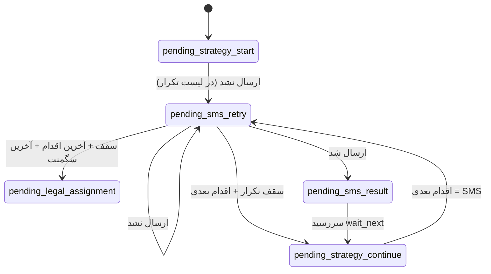

# مستند فنی — سیستم وصول مطالبات دیجی‌پی

این سند برای توسعه‌دهندگان است: معماری، ساختار فایل‌ها، منطق اصلی backend/frontend، و مرجع API.

> مرجع نیازمندی محصول: [PRD-DigiPay.md](./PRD-DigiPay.md) (بخش‌های ۵.۹، ۵.۱۰ و **۱۰**)

---

## فهرست

1. [نمای کلی معماری](#۱-نمای-کلی-معماری)
2. [Backend — ساختار و لایه‌ها](#۲-backend--ساختار-و-لایه‌ها)
3. [Frontend — ساختار](#۳-frontend--ساختار)
4. [موتور استراتژی (Strategy Engine)](#۴-موتور-استراتژی-strategy-engine)
5. [جریان‌های اصلی داده](#۵-جریان‌های-اصلی-داده)
6. [API Reference](#۶-api-reference)
7. [دیتابیس](#۷-دیتابیس)
8. [تاریخ، زمان و وضعیت اقدام](#۸-تاریخ-زمان-و-وضعیت-اقدام)
9. [متغیرهای محیطی و اسکریپت‌ها](#۹-متغیرهای-محیطی-و-اسکریپت‌ها)

---

## ۱. نمای کلی معماری

```
┌─────────────────┐     HTTP/JSON      ┌──────────────────────────────────┐
│  React (Vite)   │ ◄────────────────► │  Express (port 3000)             │
│  port 5173      │                    │  routes → services → db (sql.js) │
└─────────────────┘                    └──────────────┬───────────────────┘
                                                    │
                    ┌───────────────────────────────┼───────────────────────┐
                    │                               │                       │
              database.sqlite              node-cron (1 min)          Kavenegar SMS
                    │                               │
                    │                    strategy-engine.service.js
                    │                    payment-import (resume)
                    └───────────────────────────────┘
```

**چرخه حیات یک پرونده (خلاصه):**

```
Excel/Sheet → case-import → CEI → سگمنت → استراتژی
    → pending_strategy_start → [اقدام ۱ → ۲ → … → N]
    → paid | burned | pending_legal_assignment | استراتژی جدید (شکست + CEI boost)
```

**۱۵ وضعیت پرونده** — مرجع کامل: `frontend/src/utils/constants.js` → `CASE_STATUS` و PRD بخش ۶.۱.

---

## ۲. Backend — ساختار و لایه‌ها

```
backend/src/
├── server.js                 # initDatabase → createApp → listen → startScheduler
├── app.js                    # mount همه routeها زیر /api/*
├── db/
│   ├── database.js           # sql.js: init, query, run, persist, migrateSchema, sanitizeParams
│   ├── schema.sql            # DDL جداول
│   ├── seed.js               # داده دمو
│   ├── cei.js                # computeCei, applyCeiBoost
│   ├── segmentUtil.js        # بازه CEI، overlap، validateCondition
│   ├── dateUtil.js           # تاریخ شمسی/میلادی، next_action_date، calcActionStatus
│   └── strategyActions.js    # CRUD/validate اقدام‌ها + repeat_on_results
├── routes/                   # thin controllers — parse request, call service, JSON response
└── services/                 # business logic
    ├── strategy-engine.service.js   # اجرای خودکار استراتژی ★
    ├── case-import.service.js       # Excel پرونده + pipeline CEI/سگمنت/استراتژی
    ├── payment-import.service.js    # Excel پرداخت + resume استراتژی
    ├── bulk-assign.service.js       # تخصیص گروهی Excel
    ├── sms.service.js               # Kavenegar / SMS_MOCK
    ├── scheduler.js                 # cron هر دقیقه → strategyEngine.run()
    └── debtor-cleanup.service.js    # حذف بدهکار
```

### ۲.۱ لایه دیتابیس (`database.js`)

- از **sql.js** (SQLite WASM) به‌جای `better-sqlite3` (مشکل build روی Windows).
- فایل: `backend/database.sqlite`
- هر `run()` → `persist()` روی فایل.
- Migration سبک در `migrateSchema()` (ستون‌های جدید با `ALTER TABLE IF NOT EXISTS`).
- **مهم:** sql.js مقدار `undefined` را bind نمی‌کند — `sanitizeParams()` همه `undefined` را به `null` تبدیل می‌کند.
- Migration `repeat_on_results`: پیش‌فرض SMS → `["ارسال نشد"]`، Autocall → `["پاسخگو نبود","اشغال بود"]`، Negotiator → `["پاسخگو نبود"]`.

### ۲.۲ سرویس‌های کلیدی

| سرویس | مسئولیت |
|--------|---------|
| `case-import.service.js` | پردازش هر ردیف Excel: ایجاد/آپدیت پرونده، CEI، سگمنت، استراتژی، منطق ۵.۴ PRD (Skip اقدام، respite) |
| `strategy-engine.service.js` | اجرای اقدام‌های خودکار، تکرار شرطی (`repeat_on_results`)، عبور به اقدام بعدی، شکست استراتژی |
| `payment-import.service.js` | ثبت پرداخت جزئی/کامل، به‌روزرسانی مالی، resume استراتژی |
| `sms.service.js` | `sendSms` (Kavenegar یا `SMS_MOCK`), placeholder `{نام_کاربر}`, `{مبلغ_مطالبات}`, `{لینک_پرداخت}`. **نتیجه delivery** در موتور استراتژی جداگانه Mock می‌شود. |

---

## ۳. Frontend — ساختار

```
frontend/src/
├── main.jsx, App.jsx
├── routes/
│   ├── AppRoutes.jsx         # /cases, /debtors, /strategies, /bulk-operations, …
│   └── navItems.js           # منوی sidebar + adminOnly
├── pages/
│   ├── Cases.jsx             # جدول پرونده + سایدبار + مدال تماس/تخصیص
│   ├── Strategies.jsx        # CRUD استراتژی + AbTestModal + normalizeStrategyAction
│   ├── BulkOperations.jsx    # آپلود Excel
│   ├── Reports.jsx           # گزارش خلاصه + نرخ تبدیل + A/B
│   ├── History.jsx           # Audit Trail سراسری
│   ├── Debtors.jsx           # لیست بدهکاران
│   ├── Installments.jsx      # اقساط
│   ├── Negotiators.jsx       # مذاکره‌کنندگان
│   └── AdminPanel.jsx        # CEI، سگمنت، تنظیمات، …
├── components/
│   ├── table/                # CasesTable, CasesFilters, Badge
│   ├── sidebar/              # CaseDetailSidebar, DebtorDetailSidebar
│   ├── modal/                # CallOutcomeModal, AssignModal
│   └── admin/                # StrategyActionsBuilder (RepeatResultsMultiSelect), …
├── api/                      # axios wrappers — یک فایل per domain
└── utils/
    ├── constants.js          # CASE_STATUS (۱۵), ACTION_TYPE, HISTORY_OPERATIONS
    ├── format.js             # formatRial, toFaDigits, formatDate
    ├── historyDetails.js     # فرمت جزئیات case_history برای UI
    └── auth.js               # currentUser mock (admin / negotiator)
```

**اتصال API:** `frontend/src/api/client.js` → `baseURL: http://localhost:3000/api`

**UI سازنده استراتژی:** `StrategyActionsBuilder.jsx` — dropdown چندانتخابی (`RepeatResultsMultiSelect`) برای `repeat_on_results`؛ گزینه‌ها per `action_type` از `REPEAT_RESULTS_BY_TYPE`.

**مدال ثبت خروجی تماس:** `CallOutcomeModal.jsx`

| `call_status` | فیلد `call_duration` |
|---------------|----------------------|
| `پاسخگو نبود` | `disabled`، مقدار خالی، ارسال `0` |
| `پاسخگو بود` / `ناسزا گفت` | فعال، اجباری، `min=1` |

---

## ۴. موتور استراتژی (Strategy Engine)

**فایل:** `backend/src/services/strategy-engine.service.js`  
**Trigger:** `scheduler.js` — `cron.schedule('* * * * *', …)` هر ۱ دقیقه

### ۴.۱ وضعیت‌های قابل پردازش توسط موتور

| وضعیت | معنی |
|--------|------|
| `pending_strategy_start` | شروع اولین اقدام استراتژی |
| `pending_strategy_continue` | پایان یک اقدام — آماده شروع **اقدام بعدی** |
| `pending_sms_retry` | انتظار ارسال مجدد همان پیامک |
| `pending_autocall_retry` | انتظار تماس خودکار مجدد |
| `pending_sms_result` | پیامک موفق — انتظار `wait_next_minutes` قبل از اقدام بعدی |
| `pending_autocall_result` | اتوکال موفق — انتظار `wait_next_minutes` قبل از اقدام بعدی |

وضعیت‌های مذاکره (`pending_negotiator_*`, `in_negotiation`, `pending_negotiator_recall`) توسط route `call-outcome` و `processNegotiatorResultDueCase` مدیریت می‌شوند.

### ۴.۲ انواع اقدام استراتژی

| `action_type` | اجرا |
|---------------|------|
| `warning_sms` | ارسال SMS (Kavenegar یا شبیه‌سازی) + نتیجه Mock تصادفی |
| `threatening_sms` | همان منطق warning_sms |
| `warning_autocall` | شبیه‌سازی تماس (تأخیر ۱–۳ ثانیه) + نتیجه Mock تصادفی |
| `threatening_autocall` | همان منطق warning_autocall |
| `negotiator_call` | `pending_negotiator_assignment` یا `pending_negotiator_call` |

### ۴.۳ فیلدهای پیشرفت روی پرونده

| فیلد | نقش |
|------|-----|
| `current_action_seq` | `seq` اقدام استراتژی در حال اجرا (از `strategy_actions.seq`) |
| `current_action_repeat` | تعداد تلاش‌های انجام‌شده روی **همان** اقدام |
| `max_call_count` | سقف تماس مذاکره (= `max_repeat` اقدام negotiator_call) |
| `cei_boost` | مجموع افزایش CEI ناشی از شکست استراتژی |
| `next_action_date` | زمان اجرای بعدی (Gregorian `YYYY-MM-DD HH:mm:ss`) |

### ۴.۴ `repeat_on_results` — تکرار شرطی

**فایل‌های مرجع:** `strategyActions.js` (parse/validate/serialize)، `strategy-engine.service.js` (`executeAutomatedAction`)، `cases.js` (`call-outcome`)

| قانون | رفتار |
|--------|--------|
| لیست **خالی** | هیچ نتیجه‌ای تکرار نمی‌شود → مستقیم عبور به اقدام بعدی (یا wait_next در صورت موفقیت) |
| نتیجه **در لیست** و `attemptsMade < max_repeat` | تکرار همان اقدام با `wait_repeat_minutes` |
| نتیجه در لیست و سقف پر | `advanceAfterExhaustion` یا `handleStrategyFailure` |
| نتیجه **خارج از لیست** | بدون تکرار → اقدام بعدی |

**نتایج مجاز (برچسب فارسی — JSON در DB):**

```javascript
// backend/src/db/strategyActions.js → REPEAT_RESULTS_BY_TYPE
warning_sms / threatening_sms:     ['ارسال شد', 'ارسال نشد']
warning_autocall / threatening_autocall: ['پاسخگو بود', 'پاسخگو نبود', 'اشغال بود']
negotiator_call:                   ['پاسخگو بود', 'پاسخگو نبود', 'ناسزا گفت']
```

### ۴.۵ منطق تکرار (SMS / Autocall)

```
max_repeat = حداکثر تعداد کل اجرای همان اقدام (مثلاً ۳)

shouldRetry = repeat_on_results.includes(outcome) && attemptsMade < max_repeat

تلاش ۱: repeat 0→1, pending_sms_retry (اگر shouldRetry)
...
تلاش ۳: repeat 2→3 → سقف پر → advanceAfterExhaustion یا handleStrategyFailure
```

- شمارنده از `current_action_repeat` وقتی `current_action_seq === action.seq`
- قبل از ارسال SMS: اگر `attemptsBefore >= max_repeat` → بدون ارسال، مستقیم advance
- **نتیجه Mock (weighted random)** پس از اجرای اقدام:
  - **پیامک:** ۸۵٪ «ارسال شد» · ۱۵٪ «ارسال نشد»
  - **تماس خودکار:** ۴۰٪ «پاسخگو بود» · ۴۰٪ «پاسخگو نبود» · ۲۰٪ «اشغال بود»
- پیامک از Kavenegar ارسال می‌شود (`SMS_MOCK=false`) یا فقط در لاگ شبیه‌سازی می‌شود (`SMS_MOCK=true`); نتیجه delivery در هر دو حالت Mock بالا تصمیم‌گیری می‌کند.

### ۴.۶ عبور به اقدام بعدی / شکست

```
advanceAfterExhaustion:
  اگر اقدام بعدی وجود دارد → pending_strategy_continue + next_action_date
  اگر آخرین اقدام بود    → handleStrategyFailure
```

**شکست استراتژی (`handleStrategyFailure`):**

1. اگر آخرین سگمنت → `pending_legal_assignment`
2. وگرنه: CEI boost متناسب → سگمنت بعدی → استراتژی جدید → `pending_strategy_start`
3. ثبت marker `strategy_failure` در `case_actions` + history
4. `strategy_failure_count` در پاسخ `GET /cases/:id`

### ۴.۷ دیاگرام — پیامک با `repeat_on_results = ["ارسال نشد"]`



---

## ۵. جریان‌های اصلی داده

### ۵.۱ ورود پرونده از Excel

**Route:** `POST /api/bulk/upload-cases`  
**Service:** `case-import.service.js`

برای هر ردیف:

1. اعتبارسنجی ستون‌ها و مقادیر
2. اگر `paid`/`burned` → خطا یا فقط آپدیت مالی
3. پرونده جدید → CEI → سگمنت → استراتژی (با A/B Test) → `pending_strategy_start`
4. پرونده فعال + افزایش مطالبات → CEI مجدد، منطق تغییر سگمنت/استراتژی (بخش ۵.۴ PRD)
5. ثبت `case_history` در هر مرحله

### ۵.۲ ثبت خروجی تماس مذاکره‌کننده

**Route:** `POST /api/cases/:id/call-outcome`  
**File:** `routes/cases.js` · **UI:** `CallOutcomeModal.jsx`

**اعتبارسنجی `call_duration`:**

```javascript
const isNoAnswer = call_status === 'پاسخگو نبود' || call_status === 'no_answer';
const callDuration = isNoAnswer ? 0 : Number(call_duration);
// اگر !isNoAnswer → callDuration باید > 0
```

**هزینه تماس:**

```javascript
cost = isNoAnswer ? 0 : Math.round((hourly_wage * callDuration) / 60);
```

- سقف تماس: `current_action_repeat >= max_call_count` → 400
- **`shouldRetryNegotiator`:** `repeat_on_results.includes(call_status)` و سقف پر نشده → `pending_negotiator_recall` + `wait_repeat_minutes`
- **پاسخگو نبود** ولی **خارج از** `repeat_on_results` (یا سقف پر) → `next_action_date = now` برای عبور موتور به اقدام بعدی / شکست
- در آخرین تماس مجاز → `next_action_date = now` (بدون زمان‌بندی تماس بعدی)
- ثبت `case_actions` + `promises` (در صورت تعهد) + SMS عدم پاسخگویی (اگر پاسخگو نبود و مشمول تکرار)

### ۵.۳ آپلود پرداخت

**Route:** `POST /api/bulk/upload-payments`  
**Service:** `payment-import.service.js`

- پرداخت کامل → `paid`
- پرداخت جزئی → به‌روزرسانی مالی + زمان‌بندی resume استراتژی
- `processDuePartialPaymentResumes()` در هر tick موتور

### ۵.۴ تخصیص پرونده

**Route:** `POST /api/cases/:id/assign`

- بررسی ظرفیت مذاکره‌کننده
- یک بدهکار = یک مذاکره‌کننده فعال
- history: «تخصیص به مذاکره‌کننده» / «تخصیص مجدد»

---

## ۶. API Reference

پایه: `http://localhost:3000/api`

### Health

| Method | Path | توضیح |
|--------|------|--------|
| GET | `/health` | `{ ok: true }` |

### Cases — `/cases`

| Method | Path | Query / Body | توضیح |
|--------|------|--------------|--------|
| GET | `/` | `debtor_name`, `national_code`, `credit_id`, `credit_type`, `case_status`, `action_status`, `negotiator_name`, `page` | لیست paginated (100/page) + `action_status` محاسب‌شده |
| GET | `/:id` | — | جزئیات + actions + promises + negotiator_stage + strategy_failure_count |
| GET | `/:id/history` | `operation`, `user_name`, `from_date`, `to_date` | Audit Trail پرونده |
| GET | `/:id/installments` | — | اقساط پرونده |
| POST | `/:id/assign` | `{ negotiator_id, user_name? }` | تخصیص / تخصیص مجدد |
| POST | `/:id/call-outcome` | `{ call_status, call_duration?, … }` | ثبت خروجی تماس — `call_duration` اجباری فقط برای «پاسخگو بود» / «ناسزا گفت»؛ برای «پاسخگو نبود» → ۰ و هزینه ۰ |

### Debtors — `/debtors`

| Method | Path | توضیح |
|--------|------|--------|
| GET | `/` | لیست با فیلتر |
| GET | `/:id` | جزئیات + پرونده‌ها + شماره‌ها |
| POST | `/:id/phone-numbers` | افزودن شماره تماس |

### Negotiators — `/negotiators`

| Method | Path | توضیح |
|--------|------|--------|
| GET | `/` | لیست + آمار محاسباتی |
| POST | `/` | ایجاد |
| PUT | `/:id` | ویرایش |

### Segments — `/segments`

| Method | Path | توضیح |
|--------|------|--------|
| GET | `/` | لیست |
| POST | `/` | ایجاد (بررسی overlap) |
| PUT | `/:id` | ویرایش |
| DELETE | `/:id` | حذف |

### Strategies — `/strategies`

| Method | Path | Body | توضیح |
|--------|------|------|--------|
| GET | `/` | — | لیست + A/B info |
| GET | `/:id` | — | جزئیات + actions |
| POST | `/` | `{ title, credit_type, segment_id, actions[] }` | ایجاد |
| PUT | `/:id` | `{ actions[] }` | ویرایش (title/segment در edit قفل) |
| DELETE | `/:id` | — | حذف |

**ساختار یک action در body:**

```json
{
  "action_type": "warning_sms",
  "body_text": "کاربر گرامی {نام_کاربر} …",
  "allowed_from": "09:00",
  "allowed_to": "18:00",
  "wait_next_minutes": 1440,
  "wait_repeat_minutes": 60,
  "max_repeat": 3,
  "repeat_on_results": ["ارسال نشد"],
  "cost": 500,
  "avg_call_duration": 5
}
```

### A/B Tests — `/ab-tests`

| Method | Path | توضیح |
|--------|------|--------|
| GET | `/` | لیست |
| POST | `/` | ایجاد سناریو (+ دو استراتژی) |
| DELETE | `/:id` | حذف |

### CEI Formulas — `/cei-formulas`

| Method | Path | توضیح |
|--------|------|--------|
| GET | `/` | نسخه فعال + history |
| PUT | `/` | نسخه جدید |
| POST | `/test` | `{ credit_id }` — پیش‌نمایش CEI |

### Settings — `/settings`

| Method | Path | توضیح |
|--------|------|--------|
| GET | `/` | key→value |
| GET | `/history` | `?key=` |
| PUT | `/` | `{ key: value, … }` |

### Bulk — `/bulk`

| Method | Path | Body (multipart) | توضیح |
|--------|------|------------------|--------|
| POST | `/upload-cases` | `file`, `user_name?` | Excel پرونده |
| POST | `/upload-payments` | `file`, `user_name?` | Excel پرداخت |
| POST | `/assign-cases` | `file` | تخصیص گروهی |
| POST | `/reassign-cases` | `file` | تخصیص مجدد |
| POST | `/delete-all-except-mobile` | `{ mobile }` | پاکسازی DB |
| POST | `/delete-debtor-by-mobile` | `{ mobile }` | حذف یک بدهکار |
| GET | `/history` | — | تاریخچه عملیات گروهی |
| GET | `/error-report/:id` | — | دانلود خطاهای bulk |

### Reports — `/reports`

| Method | Path | Query | توضیح |
|--------|------|-------|--------|
| GET | `/summary` | `credit_type?`, `from_date?`, `to_date?` | خلاصه وضعیت (۱۵ وضعیت) و وصول |
| GET | `/action-conversion` | filters | نرخ تبدیل اقدام‌ها |
| GET | `/ab-tests` | filters | گزارش A/B |

### Google Sheet — `/gsheet`

| Method | Path | توضیح |
|--------|------|--------|
| POST | `/test` | اعتبارسنجی URL (دمو — سینک کامل پیاده نشده) |

---

## ۷. دیتابیس

فایل schema: `backend/src/db/schema.sql`

### جداول اصلی

| جدول | نقش |
|------|-----|
| `debtors`, `phone_numbers`, `addresses` | بدهکار |
| `cases` | پرونده وصول — قلب سیستم |
| `segments`, `strategies`, `strategy_actions` | سگمنت و استراتژی |
| `ab_tests` | A/B Test |
| `case_actions` | سابقه اقدامات (seq زمانی global) |
| `case_history` | Audit Trail |
| `promises` | تعهد پرداخت (PTP) |
| `installments`, `payments` | اقساط و پرداخت |
| `negotiators` | مذاکره‌کنندگان |
| `cei_formulas`, `settings`, `settings_history` | پیکربندی |
| `bulk_operations` | لاگ آپلودهای گروهی |

### فیلدهای مهم `cases`

```
case_status, current_action_seq, current_action_repeat, max_call_count
next_action, next_action_date, action_status
cei, cei_boost, segment_id, strategy_id
assigned_negotiator_id, call_count, case_cost
```

### فیلدهای `strategy_actions`

```
seq, action_type, body_text
allowed_from, allowed_to
wait_next_minutes      — فاصله قبل از اقدام بعدی (دقیقه)
wait_repeat_minutes    — فاصله بین تکرار همان اقدام (دقیقه)
max_repeat             — سقف کل اجرای همان اقدام (همه انواع)
repeat_on_results      — JSON array برچسب فارسی — نتایج مشمول تکرار
cost, avg_call_duration
```

---

## ۸. تاریخ، زمان و وضعیت اقدام

**فایل:** `backend/src/db/dateUtil.js`

| تابع | کار |
|------|-----|
| `nowDatetime()` | `YYYY-MM-DD HH:mm:ss` — برای `next_action_date` |
| `todayJalali()` | تاریخ شمسی برای نمایش |
| `computeNextActionDate(waitMinutes, nextAction)` | now + wait + رعایت بازه مجاز |
| `calcActionStatus(next_action_date)` | `waiting` / `due_today` / `overdue` |
| `isActionDue(next_action_date)` | آیا موتور باید اجرا کند؟ |

---

## ۹. متغیرهای محیطی و اسکریپت‌ها

### `.env`

| متغیر | پیش‌فرض | توضیح |
|--------|---------|--------|
| `PORT` | 3000 | پورت سرور |
| `KAVENEGAR_API_KEY` | — | کلید API |
| `KAVENEGAR_SENDER` | — | خط فرستنده |
| `SMS_MOCK` | — | `true` = بدون API واقعی |

### اسکریپت‌های `backend/scripts/`

| فایل | کار |
|------|-----|
| `inspect-case.js` | دیباگ پرونده با `credit_id` — وضعیت، history، actions |
| `delete-debtor-by-mobile.js` | حذف بدهکار |
| `delete-all-except-mobile.js` | پاکسازی |
| `seed-zahra-hamdi-cases.js` | seed تست |
| `add-payment-test-cases.js` | پرونده تست پرداخت |
| `clear-ab-tests.js` | پاک کردن A/B tests |

---

## پیوست — نگاشت وضعیت در UI

مرجع: `frontend/src/utils/constants.js` → `CASE_STATUS`, `ACTION_TYPE`, `HISTORY_OPERATIONS`

### وضعیت‌های پرونده (۱۵)

`pending_cei` · `pending_strategy` · `pending_strategy_start` · `pending_strategy_continue` · `pending_sms_result` · `pending_sms_retry` · `pending_autocall_result` · `pending_autocall_retry` · `pending_negotiator_assignment` · `pending_negotiator_call` · `pending_negotiator_recall` · `in_negotiation` · `pending_legal_assignment` · `paid` · `burned`

### عملیات مهم history

- `اجرای پیامک` / `اجرای پیامک (شبیه‌سازی)` / `ارسال ناموفق پیامک — تلاش مجدد`
- `اجرای تماس خودکار` / `تماس خودکار ناموفق — تلاش مجدد`
- `عبور به اقدام بعدی استراتژی` / `پایان استراتژی` / `شکست استراتژی`
- `بازگشت به تماس مذاکره‌کننده` / `ثبت خروجی تماس`
- `تخصیص به مذاکره‌کننده` / `تخصیص مجدد`
- `پرداخت کامل بدهی` / `پرداخت جزئی بدهی` / `ادامه استراتژی پس از پرداخت جزئی`

لیست کامل: آرایه `HISTORY_OPERATIONS` در `constants.js` (۳۲+ عملیات).

### احراز هویت (دمو)

فقط mock در `frontend/src/utils/auth.js` — backend middleware واقعی ندارد.

---

*آخرین به‌روزرسانی: `repeat_on_results` · مدت تماس شرطی (پاسخگو نبود → ۰) · ۱۵ وضعیت پرونده · هم‌راستا با PRD بخش ۱۰*
